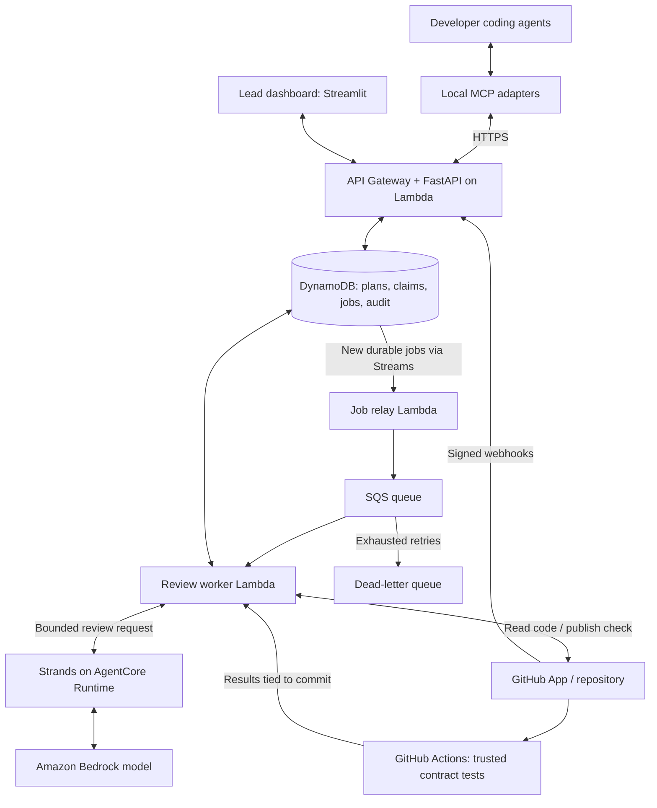

# Midflight: proposed architecture and reading guide

Prepared October 6, 2026. A recommendation for discussion, not an approved change to the requirements or an implementation plan already executed.

Based on `PROJECT_REQUIREMENTS.md`, the repository README, `docs/design-decisions.md`, and the workflow diagrams. Assumption: prioritize the AWS hackathon demonstration for one repository and 2–4 developers, while keeping components replaceable.

**Recommendation**

Build one Python application with separate API and background-worker entry points. Use a local MCP adapter to connect each coding agent, a Streamlit dashboard for the lead, DynamoDB for durable state, and SQS for background jobs. Use Strands with a Bedrock model for semantic reviews; host that reasoning component on AgentCore Runtime for the planned AWS demonstration.

The central design principle is that application code owns permissions, versions, and state transitions. The model proposes findings. Humans own product decisions. Midflight's records, rather than any model conversation, establish what is currently approved.

**Technology choices and their purpose**

| Component | Recommended technology | Why it fits Midflight |
| --- | --- | --- |
| Language and data validation | Python, Pydantic, uv | Extends the existing Python prototype; typed schemas for claims, plans, directives, and findings; one language across the MVP. Pin mutually compatible versions during setup. |
| API | FastAPI | One entry point for the dashboard and MCP adapters, with request validation and generated API documentation. |
| API hosting | API Gateway HTTP API, Lambda, Mangum | Public HTTPS endpoint for clients and GitHub webhooks; Mangum adapts the Python web application to Lambda events. |
| State | DynamoDB | Store versioned records and use conditional writes/transactions to prevent obsolete approvals. Design around concrete lookups rather than arbitrary searches. |
| Jobs | SQS, worker Lambda, dead-letter queue | Reviews happen after requests return. Failed work can retry and exhausted failures remain inspectable. |
| Semantic reviewer | Strands Agents SDK with Amazon Bedrock | Compare meaning across claims, contracts, and selected code; return structured findings for validation. |
| Reviewer hosting | Bedrock AgentCore Runtime | Host the Strands reviewer separately from the API and its state-changing logic. |
| Agent integration | Official MCP Python SDK; local stdio adapter | Expose a few tools to each developer's coding agent, forwarding authorized requests to the shared API. |
| GitHub integration | GitHub App and HTTPX | Read repository/PR evidence and publish `midflight/verify` check runs. |
| Lead dashboard | Streamlit, initially local | A small Python interface for plans, approvals, findings, directives, and review status. |
| Verification | pytest and GitHub Actions | Run trusted contract tests against the exact commit under review in isolated CI. |
| Deployment and operations | AWS SAM, AgentCore deployment tooling, IAM, Secrets Manager, CloudWatch | Reproducible infrastructure, scoped service permissions, secret storage, and observable jobs. |

FastAPI's validation/documentation and Mangum's Lambda integration are documented in the [FastAPI guide](https://fastapi.tiangolo.com/) and [Mangum documentation](https://mangum.fastapiexpert.com/). Streamlit uses a running Python server; keep it on the lead's laptop for the demo rather than trying to package the dashboard into the API Lambda. See [Streamlit architecture](https://docs.streamlit.io/develop/concepts/architecture/architecture).

**How the pieces connect**

The CI-results arrow represents the worker retrieving completed run evidence through GitHub APIs; it does not require a public worker endpoint. The dashboard and adapters read status through the API. Secrets, logs, authentication, and recovery scheduling are omitted from the diagram for readability.

Persist the claim and its pending job together. A relay delivers durable jobs to SQS, and a reconciliation process recovers jobs left undispatched. This avoids accepting a claim into the database but losing the review when queue delivery fails. This is the [transactional outbox pattern](https://docs.aws.amazon.com/prescriptive-guidance/latest/cloud-design-patterns/transactional-outbox.html). It can be implemented with DynamoDB Streams plus a relay and recoverable job records.

**The four terms that are easy to confuse**

- **Bedrock:** access to the language model.
- **Strands:** the Python framework around model calls, tools, and structured results.
- **AgentCore Runtime:** the hosting environment for that reviewer code.
- **MCP:** the interface through which the developers' coding agents call Midflight tools.

These serve separate purposes. AgentCore supports frameworks including Strands; using Bedrock does not itself require AgentCore. Keep a reviewer interface so the same bounded review can run locally during development. If AgentCore is not a hackathon requirement and deployment time becomes the constraint, running the reviewer directly in the background worker is a simpler fallback. See the [Strands overview](https://strandsagents.com/docs/) and [AgentCore Runtime guide](https://docs.aws.amazon.com/bedrock-agentcore/latest/devguide/agents-tools-runtime.html).

For the initial worker-to-AgentCore call, set a bounded review timeout that fits inside the worker's timeout and configure queue visibility accordingly. An asynchronous HTTP API does not require an unbounded agent run. Adopt AgentCore's [long-running task pattern](https://docs.aws.amazon.com/bedrock-agentcore/latest/devguide/runtime-long-run.html) only if measured review duration requires it; then persist completion independently and recover abandoned jobs.

The requirements name Claude Sonnet 4.5 as an initial candidate. Treat that as a candidate, not a final selection. Confirm account/region access and compare available models on the same Midflight examples: incompatible contracts, harmless overlap, incomplete evidence, and instruction-like repository content. Measure correct findings, unnecessary blocks, latency, and usage. Consult [Bedrock model availability](https://docs.aws.amazon.com/bedrock/latest/userguide/models-supported.html) before choosing a model ID.

**What should happen in each workflow**

1. **Claim review:** An agent calls `submit_claim`. The API authenticates it, validates references, saves a pending claim and job, and returns their IDs. The worker checks explicit rules, asks the model about semantic compatibility, validates its findings, and attempts to save the outcome against the versions it reviewed. The agent retrieves status through `get_task_context` or an explicit job-status tool.
2. **Requirement change:** The lead approves a new immutable plan version. Midflight follows declared producer/consumer dependencies, marks affected approvals for revalidation, and creates scoped directives. Agents retrieve them through `get_directives` at checkpoints and respond through `acknowledge_directive`. Acknowledgment records receipt; verification establishes implementation.
3. **Code verification:** A signed GitHub event creates a job. The worker retrieves current PR state, resolves the exact base/head commit, gathers relevant changes and full file content, and waits for trusted test evidence. It combines deterministic contract checks with semantic findings and publishes a check for that head commit. A new head or changed plan supersedes old work.
4. **Human resolution:** Ambiguous requirements or unsupported findings appear in the dashboard. The lead records a reasoned resolution; any resulting plan or claim change triggers revalidation.

GitHub recommends asynchronous webhook handling and delivery deduplication; signature validation must use the original payload. Read [webhook best practices](https://docs.github.com/en/webhooks/using-webhooks/best-practices-for-using-webhooks) and [signature validation](https://docs.github.com/en/webhooks/using-webhooks/validating-webhook-deliveries).

**The rules ordinary code must enforce**

| Ordinary application code | Model assistance | Human authority |
| --- | --- | --- |
| Identity, role, project access | Interpret declared assumptions | Approve product requirements |
| Required fields and known IDs | Identify semantic incompatibility | Resolve competing product intent |
| Explicit schema/contract checks | Explain likely downstream effects | Accept material scope changes |
| Duplicate-event handling | Propose a correction with evidence | Dismiss findings with a reason |
| Version checks and state transitions | Flag uncertainty | Approve agreements that establish new authoritative requirements |

Unknown evidence must remain unknown. Missing fields, failed API calls, or malformed model output cannot become a pass. The model does not receive arbitrary shell access or permission to approve a plan.

For concurrency, maintain a coordination revision for each project. Every relevant claim or plan mutation advances it. A review reads a consistent snapshot and records its revision; its final transaction checks that revision before saving the decision and advancing it. If another claim changed the state, retry the review. This prevents two conflicting claims from both being approved against an obsolete view. Learn [DynamoDB transactions](https://docs.aws.amazon.com/amazondynamodb/latest/developerguide/transaction-apis.html) before implementing this.

Queue processing can repeat. Give jobs, webhook deliveries, directives, and external publications stable identities; use job leases and retry-safe writes. Configure visibility timeouts and failed-message recovery. FIFO ordering alone is not a substitute for these controls. See [Lambda with SQS](https://docs.aws.amazon.com/lambda/latest/dg/with-sqs.html).

For a private demo, individually issued, revocable, high-entropy bearer tokens mapped server-side to project and role are a reasonable starting proposal. Store token hashes, keep credentials out of the repository, and separate lead and agent permissions. A hosted multi-user product should use managed sign-in. GitHub App credentials authenticate Midflight to GitHub; they do not authenticate developers to Midflight.

**What passing a GitHub check means**

Store the plan version, claim revision, base SHA, head SHA, evidence coverage, and outcome with every verification. Require trusted test expectations whose source cannot be silently rewritten by the reviewed branch. Run branch code without the coordinator's credentials; retrieve test results only from the expected workflow and commit. See [GitHub Actions secure use](https://docs.github.com/en/actions/reference/security/secure-use).

Publish `success` only for current, complete evidence. Use a blocking outcome such as `action_required` for unresolved human review or incomplete evidence; do not map these to `neutral` or `skipped` and assume they block merging. Confirm the chosen mappings in the demo repository's required-check configuration. The [check-run API](https://docs.github.com/en/rest/checks/runs) documents the available states.

Recheck freshness before publication and reconcile after it. DynamoDB and GitHub cannot share one atomic transaction: a requirement change or outage can race with a check update. Display the current internal state and repair GitHub when available. Do not promise instant revocation of an existing green check during a GitHub outage.

**Alternatives and what to defer**

- Choose **DynamoDB** for the proposed AWS demo. Consider PostgreSQL if the team already knows SQL well or flexible relational reporting becomes central; the domain is relational enough that this is a legitimate alternative.
- Choose **Streamlit** for the small lead console. Reconsider React/TypeScript if a polished hosted collaboration interface becomes a primary deliverable.
- Choose **Strands** to match the AWS plan. One bounded model call may be enough at first; add tools only where review quality benefits. Do not build a coordinator swarm.
- Store explicit task-to-contract dependencies as records. The MVP does not need a graph database, vector database, embeddings, or repository-wide retrieval infrastructure.
- Use checkpoints before implementation, during meaningful work, and before push. MCP tools do not guarantee that arbitrary coding agents will interrupt themselves or call a tool on schedule.
- Keep one codebase with shared schemas and business logic. Separate deployment entry points are sufficient; independent microservices would add coordination work to this small project.

**Read in this order**

| Order | Read | What you should understand afterward |
| --- | --- | --- |
| 1 | Existing requirements and workflow examples | What a claim, approved contract, directive, and verified result each mean. |
| 2 | [FastAPI tutorial](https://fastapi.tiangolo.com/tutorial/) | How to validate a claim request, enforce an identity, and return a job ID. |
| 3 | [Build an MCP server](https://modelcontextprotocol.io/docs/develop/build-server) | How a coding agent calls a tool and how the local adapter forwards it to the shared service. |
| 4 | [Strands documentation](https://strandsagents.com/docs/) | Model invocation, bounded tools, and schema-validated findings. |
| 5 | [DynamoDB transactions](https://docs.aws.amazon.com/amazondynamodb/latest/developerguide/transaction-apis.html), [SQS workers](https://docs.aws.amazon.com/lambda/latest/dg/with-sqs.html), and [outbox](https://docs.aws.amazon.com/prescriptive-guidance/latest/cloud-design-patterns/transactional-outbox.html) | Why retries and simultaneous claims must not create conflicting decisions or lost jobs. |
| 6 | [GitHub webhooks](https://docs.github.com/en/webhooks/using-webhooks/best-practices-for-using-webhooks) and [check runs](https://docs.github.com/en/rest/checks/runs) | How a push becomes a review of one exact commit and a visible, merge-blocking result. |
| 7 | [AgentCore Runtime](https://docs.aws.amazon.com/bedrock-agentcore/latest/devguide/agents-tools-runtime.html) and [AWS SAM](https://docs.aws.amazon.com/serverless-application-model/latest/developerguide/what-is-sam.html) | Where the components run, which permissions they need, and how deployment is reproduced. |

Build confidence with one small experiment per topic rather than reading every service manual. The first vertical slice should be: two real agent sessions submit incompatible checkout claims, Midflight identifies the mismatch, the lead sees the evidence, and a revised claim passes review. Then add plan-change propagation, followed by GitHub evidence verification and recovery scenarios.

**Decisions to settle before implementation**

The existing documents disagree in two places. The design notes favor lightweight claims that can start incomplete, while the requirements demand richer claim fields. Suggested reconciliation: allow incomplete drafts but require explicit dependencies and supported criteria before approval. Also, the requirements demonstrate adding currency while the newer flowchart demonstrates subtotal/tax fields. Pick one canonical scenario before writing fixtures and tests.

Confirm the two coding-agent hosts and their MCP setup; AWS account, region, and model access; whether AgentCore and a public dashboard are hackathon requirements; and the trusted contract-test source. The existing prototype only compares declared overlaps in memory. This guide does not imply that the API, semantic review, database, or AWS deployment already exists.
