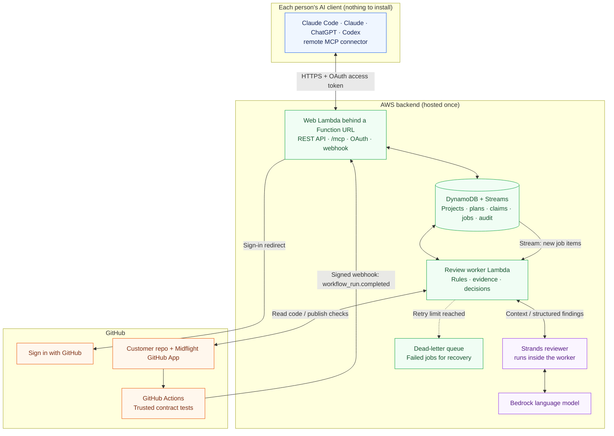
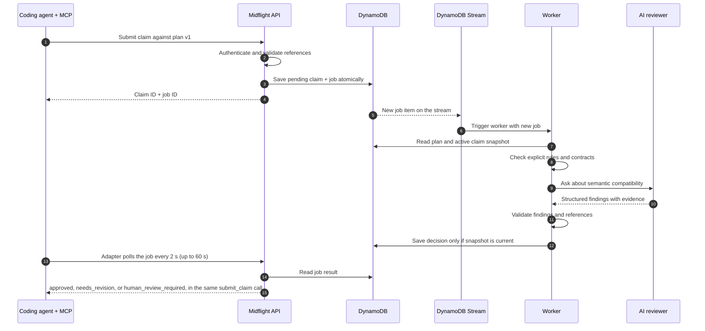
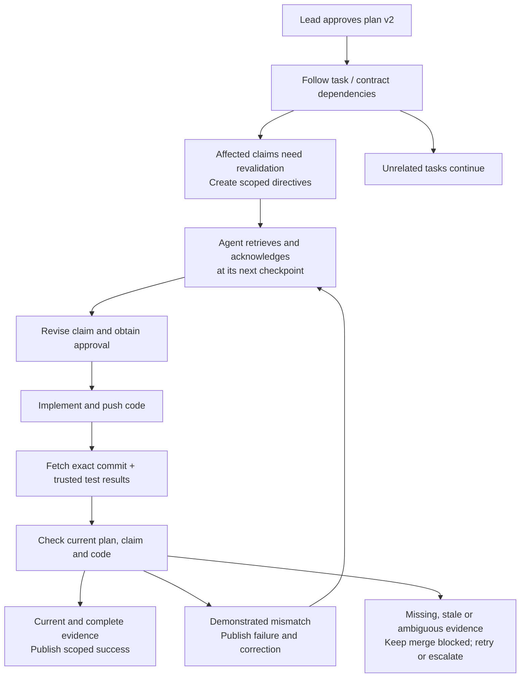

# Midflight system architecture

Proposed AWS hackathon architecture · October 6, 2026 · updated October 7 with the simplified baseline and October 8 for the hosted product (see [design-decisions.md](design-decisions.md#hosted-product-october-8-2026))

Midflight coordinates a small team's coding agents: it checks intended work against a shared plan, distributes approved requirement changes, and verifies pushed code. Start with one Python codebase, separate API and worker entry points, and one AI reviewer. One deployment serves many teams; each project covers one GitHub repository and 2–4 developers.

**1. Where everything runs**

Midflight is one hosted service (D16). Team Yoga deploys it once; every team uses it by
installing the GitHub App and adding one connector URL to their AI client.

**Reading the diagram:** an AI client connects to `/mcp` with an OAuth token it got by
signing in with GitHub. The web Lambda saves a claim and its job together, and the
DynamoDB Stream delivers the job to the worker, which gathers evidence and asks the
reviewer for findings. Workers validate those findings before updating state or
GitHub. The web Lambda sits behind a Lambda Function URL rather than API Gateway,
because `submit_claim` waits up to 60 seconds for its verdict (D19).

**2. Technologies and their roles**

| Technology | What it is and how Midflight uses it | Read more |
| --- | --- | --- |
| **Python + uv** | Python is the implementation language, extending the existing prototype. uv manages dependencies and a lockfile so teammates install compatible packages. | [Python tutorial](https://docs.python.org/3/tutorial/) · [uv](https://docs.astral.sh/uv/) |
| **Pydantic** | Defines and validates structured data: claims, plan versions, directives, and model findings. Application rules additionally check permissions, referenced IDs, and evidence. | [Models and validation](https://docs.pydantic.dev/latest/concepts/models/) |
| **FastAPI** | The backend web framework. Provides endpoints for submitting claims, reading review status, approving plans, and acknowledging directives, plus interactive API documentation. | [Tutorial](https://fastapi.tiangolo.com/tutorial/) |
| **Lambda + Function URL** | A Lambda Function URL is the public HTTPS entrance: it gives the web Lambda its own `https://…lambda-url…on.aws` address with a timeout up to 15 minutes, which the 60-second `submit_claim` wait needs (API Gateway stops at 30 seconds, D19). Lambda runs the FastAPI app (REST, `/mcp`, OAuth) without a permanently running server; reserved concurrency caps cost and abuse. | [Function URLs](https://docs.aws.amazon.com/lambda/latest/dg/urls-configuration.html) · [Lambda](https://docs.aws.amazon.com/lambda/latest/dg/welcome.html) |
| **MCP Python SDK** | MCP is the tool interface coding agents use. The backend serves a **remote MCP endpoint** at `/mcp` (SDK 2 `MCPServer`, streamable HTTP, stateless) with the agent tools `submit_claim`, `check_in`, and `acknowledge_directive`, plus project and lead tools (D16). The SDK also provides the OAuth authorization server the MCP spec requires; Midflight's sends people to GitHub to sign in (D17). The server's instructions tell each agent to plan checkpoints and report its assumptions (D10). A local stdio adapter remains as a development tool (D20). | [Build an MCP server](https://modelcontextprotocol.io/docs/develop/build-server) |
| **DynamoDB + Boto3** | DynamoDB stores authoritative, versioned state. Conditional writes and transactions protect concurrent decisions. Boto3 is the Python SDK used to call AWS services. | [DynamoDB transactions](https://docs.aws.amazon.com/amazondynamodb/latest/developerguide/transaction-apis.html) · [Boto3](https://boto3.amazonaws.com/v1/documentation/api/latest/index.html) |
| **DynamoDB Streams + worker Lambda** | Streams exposes committed database changes. The worker Lambda is triggered by the stream, filtered to new job items, with batch size 1 and 2 retries. Saving the claim and its job in one write means accepted work can't be lost. | [Transactional outbox pattern](https://docs.aws.amazon.com/prescriptive-guidance/latest/cloud-design-patterns/transactional-outbox.html) · [Lambda with DynamoDB Streams](https://docs.aws.amazon.com/lambda/latest/dg/with-ddb.html) |
| **SQS dead-letter queue + Powertools** | Jobs that exhaust their retries land in an SQS dead-letter queue for inspection. Powertools for AWS Lambda provides idempotency, so a repeated delivery produces one outcome. | [Powertools idempotency](https://docs.powertools.aws.dev/lambda/python/latest/utilities/idempotency/) |
| **Strands Agents SDK** | The framework around the reviewer: prompts, model calls, optional bounded tools, and structured outputs. It helps detect semantic incompatibility, such as dollars versus cents across connected claims. | [Strands documentation](https://strandsagents.com/docs/) |
| **Amazon Bedrock** | Provides access to the language model used by Strands. Select a model available in the team's account/region after comparing conflict detection, latency, and cost on demo examples. | [Supported models](https://docs.aws.amazon.com/bedrock/latest/userguide/models-supported.html) |
| **AgentCore Runtime (not used)** | An AWS service for hosting agent code. Decided October 7: the hackathon does not require it, so the Strands reviewer runs inside the worker Lambda. It stays behind a `Reviewer` interface and could move here later. | [Runtime overview](https://docs.aws.amazon.com/bedrock-agentcore/latest/devguide/agents-tools-runtime.html) |
| **GitHub App + githubkit** | One public App, installed by each team on its repo, gives Midflight repository permissions: read contents, pull requests, and Actions results, receive events, and write checks. The same App's user authorization is how people **sign in with GitHub** (D17). githubkit is the typed Python client that handles App and user authentication. | [GitHub Apps](https://docs.github.com/en/apps/creating-github-apps/about-creating-github-apps/about-creating-github-apps) · [githubkit](https://github.com/yanyongyu/githubkit) |
| **pytest + GitHub Actions** | pytest tests Midflight's rules and the demo's interface behavior. Actions executes trusted contract tests against the reviewed commit in isolated CI; the worker retrieves their results. | [pytest](https://docs.pytest.org/en/stable/) · [Actions security](https://docs.github.com/en/actions/reference/security/secure-use) |
| **Lead tools instead of a dashboard** | The lead works through the same connector: `project_status`, `propose_plan`, `approve_plan`, `assign_task`, and `resolve_escalation` (D16). A read-only status page served by the backend is stretch task X-3. | — |
| **AWS SAM** | Describes supporting infrastructure as code and deploys the web Lambda with its Function URL, the worker, the queue, the database, and secrets reproducibly. | [SAM introduction](https://docs.aws.amazon.com/serverless-application-model/latest/developerguide/what-is-sam.html) |
| **IAM · Secrets Manager · CloudWatch** | IAM limits each service's AWS permissions. Secrets Manager stores GitHub credentials and webhook secrets. CloudWatch records failures, latency, and usage to help debug and control costs. | [IAM](https://docs.aws.amazon.com/IAM/latest/UserGuide/introduction.html) · [Secrets](https://docs.aws.amazon.com/secretsmanager/latest/userguide/intro.html) · [Monitoring](https://docs.aws.amazon.com/AmazonCloudWatch/latest/monitoring/WhatIsCloudWatch.html) |

**Remember:** Bedrock supplies the model; Strands organizes the review inside the worker; MCP connects the developers' agents to Midflight.

**3. A claim review, step by step**

A backend claim returning integer `total_cents` and a frontend claim expecting decimal `total` may touch different files yet conflict. Explicit contracts enable deterministic checks; the model helps interpret assumptions and explain mismatches. Shared file access alone requests attention rather than automatically rejecting work.

**4. Changes during work and verification after a push**

Acknowledgment means an update was received. Verification establishes whether the implementation follows it. MCP relies on agents checking in before implementation, at the checkpoints they plan at the critical points of their task (D10), and before pushing.

GitHub webhooks must be signature-validated and recorded durably before acknowledgment. Publish `midflight/verify` for the reviewed commit, and configure it as a required check. Read [webhook handling](https://docs.github.com/en/webhooks/using-webhooks/best-practices-for-using-webhooks), [signature validation](https://docs.github.com/en/webhooks/using-webhooks/validating-webhook-deliveries), and [check runs](https://docs.github.com/en/rest/checks/runs).

**5. Rules that make the architecture trustworthy**

- **Authority:** humans approve product requirements; the model proposes findings; application code enforces permissions and decisions.
- **Versions:** every result records its plan version, claim revision, and applicable commit. Recheck freshness before saving or publishing; reconcile GitHub after changes or outages.
- **Concurrency:** use a project coordination revision. Every relevant mutation advances it; a final approval transaction checks the revision reviewed. If it changed, re-review.
- **Evidence:** validate findings and test provenance. Missing evidence stays unresolved; tests run without the coordinator's credentials, with expectations controlled independently of the reviewed branch.
- **Identity:** people sign in with GitHub; Midflight issues short-lived OAuth tokens mapped to a GitHub account, and each project membership carries a role. Lead-only actions require the lead role. GitHub App credentials serve the repository integration separately.
- **Recovery:** stable job and delivery IDs prevent duplicate outcomes. Bound model calls to fit worker timeouts, expose failed jobs, and reconcile undelivered work.

**6. Reading and building order**

Read **FastAPI/Pydantic → MCP → Strands/Bedrock → DynamoDB transactions/Streams → GitHub webhooks/checks → SAM**. Use the links above for focused tutorials rather than studying every service feature.

The local slice is built (two agents' incompatible claims, the explained conflict, the passing revision). Next comes the hosted connector: projects with join codes, the remote `/mcp` endpoint, and Sign in with GitHub (H-1 to H-4); then deployment (H-5), approved-plan changes, and GitHub verification. Keep the reviewer interface replaceable so the same review logic runs locally and in the worker Lambda.

Decisions D1–D15 in [design-decisions.md](design-decisions.md) settle the agent hosts, the canonical demo change, the trigger, and the incomplete-claim policy. Ports, fakes, and the code layout are in [AGENTS.md](../AGENTS.md#ownership) and [domain.md](domain.md#ports).
