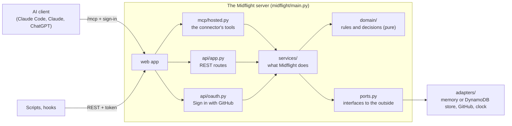

# Code guide

How the Midflight code is organized and what happens, file by file, when people use it.
Read this before opening the code. For *why* things are this way, see
[design-decisions.md](design-decisions.md); for exact names and rules,
[domain.md](domain.md).

## The big picture



Three layers, from the inside out:

1. **`domain/`** is the core: the data (models), what's allowed (states), the checks
   (rules), and the verdict (decide). No I/O at all, so it's easy to test and reason
   about.
2. **`services/`** are the things Midflight *does*: submit a claim, approve a plan,
   create a project, check in. They use the domain and talk to the outside world only
   through `ports.py`.
3. **The edges** turn requests into service calls: the hosted MCP connector
   (`mcp/hosted.py`), sign-in (`api/oauth.py`), the REST API (`api/app.py`), and the
   AWS worker (`aws/worker.py`). `main.py` wires them together.

`adapters/` are the real and fake versions of each port: in-memory or DynamoDB store,
real or fake GitHub, a real or frozen clock. Tests use the fakes; nothing in a test
touches AWS or GitHub.

## Folder by folder

### `midflight/domain/`: the rules (no I/O)

| File | What it holds |
| --- | --- |
| `models.py` | Every entity as a Pydantic model: `User`, `Project`, `Participant`, `Plan`, `Claim`, `Finding`, `Directive`, `Verification`, `Job`, ... Models reject unknown fields, can't be changed in place, and refuse data that breaks a rule they can check themselves (for example, a verification can't be `verified` with missing evidence). |
| `states.py` | Which state changes are allowed (`pending → approved`, ...). Anything else raises. |
| `rules.py` | The deterministic claim checks: unknown ids, old plan version, wrong contract field or type (`total` vs `total_cents`), scope, duplicate provider, shared files. |
| `decide.py` | Findings in, verdict out: `approved`, `needs_revision`, `draft`, `human_review_required`, or held `pending`. |
| `impact.py` | What changed between two plan versions. |

### `midflight/services/`: what Midflight does

| File | Does |
| --- | --- |
| `projects.py` | Sign in (a GitHub account becomes a `User`), create a project (checks the App is installed and you're a repo admin), join with a code, rotate the code, remove a member, assign a task. |
| `claims.py` | Submit, revise, withdraw, close a claim; run the review job (rules, then the AI reviewer, then decide, saved only if nothing changed meanwhile). |
| `review.py` | Checks the AI reviewer's reply before anything uses it; a bad reply is thrown away. |
| `plans.py` | Propose and approve plan versions (lead only). |
| `check_in.py` | What an agent gets at a checkpoint: its task, requirements, contracts, claim verdict, directives, and whether it may push. |
| `directives.py` | An agent's answer to a directive. |
| `participants.py` | Tokens for scripts and the pre-push hook (stored as hashes). |
| `audit.py`, `errors.py` | Building audit events; the errors services raise (each maps to an HTTP status). |

### The edges

| File | Does |
| --- | --- |
| `main.py` | Builds the whole server: store, services, sign-in, the connector, the REST API. `uv run midflight-server` starts it. |
| `config.py` | Settings from environment variables or `.env`. |
| `mcp/hosted.py` | The connector's 12 tools. Each one finds who's calling (from their sign-in), finds their project, calls a service, and replies in plain text. |
| `mcp/instructions.py` | The rules every connected agent is told (claim first, check in at checkpoints, ...), and the tool descriptions. |
| `mcp/replies.py` | Turns results into the text an agent reads, with directives fenced off as data. |
| `api/oauth.py` | Sign in with GitHub: the OAuth flow AI clients expect, with GitHub doing the login. |
| `api/app.py`, `api/views.py` | The REST API (for scripts and hooks) and the JSON shapes it returns. |
| `aws/worker.py` | The AWS worker Lambda: runs review jobs from the DynamoDB stream. |
| `mcp/local/` | A development tool: the agent tools over stdio, for working on Midflight locally. Customers never use it. |
| `demo.py` | The synthetic demo project (T1, T2, T3) for tests and local runs. |

### `midflight/adapters/`: the outside world

| File | Is |
| --- | --- |
| `memory_store.py` | The store in memory: for tests and a laptop. |
| `dynamo_store.py` | The same store on DynamoDB: for AWS. The same tests run against both. |
| `github.py` | Real GitHub: sign-in, and "is the App installed / is this person an admin?" |
| `fake_github.py` | Fake GitHub for tests and the dev login. |
| `runners.py` | How background jobs run: now (`InlineRunner`), when a test says (`DeferredRunner`), or by the AWS worker (`StreamRunner`). |
| `clock.py` | The real clock, and a frozen one for tests. |

### Elsewhere

| Path | Is |
| --- | --- |
| `infra/` | The AWS deploy: template, packaging, secrets ([infra/README.md](../infra/README.md)). |
| `tests/unit/` | One test file per part (below). |
| `tests/integration/` | The real server over HTTP, signing in like an AI client. |
| `tests/scenarios/` | Demo scenarios as YAML, played against the real services. |
| `docs/` | Specs, decisions, plan, and this guide. `docs/archive/` is old background. |

## Journey 1: someone adds the connector and signs in

1. They add `https://<server>/mcp` to their AI client.
2. The client calls `/mcp` without a token. The MCP SDK's auth layer (configured in
   `main.py`) answers **401**, pointing at Midflight's sign-in discovery document.
3. The client registers itself (`/register`) and opens `/authorize` in the browser.
   `MidflightOAuth.authorize` in `api/oauth.py` remembers the request and sends the
   browser to GitHub (`GitHubAppSignIn.authorize_url` in `adapters/github.py`).
4. GitHub sends the browser back to `/oauth/github/callback` with a code.
   `github_callback` trades it for the GitHub account, then
   `MidflightOAuth.finish_sign_in` calls `ProjectService.sign_in` (creating the `User`
   on first sign-in) and sends the browser back to the client with Midflight's own
   one-time code.
5. The client trades that code at `/token` for an access token (1 hour) and a refresh
   token (30 days). Codes and tokens are stored only as hashes.
6. Every `/mcp` call now carries the token. The SDK checks it with
   `MidflightOAuth.load_access_token`; the token's `subject` is the user id, which the
   tools read in `mcp/hosted.py`.

Locally with `MIDFLIGHT_DEV_LOGIN=1`, step 3 shows a form where you type a GitHub login
instead of going to GitHub. That form doesn't exist on a real server.

## Journey 2: a team forms

1. The lead's agent calls `create_project(repository="acme/shop")`
   (`mcp/hosted.py`), which calls `ProjectService.create_project`.
2. It checks the App is installed on the repo and the lead is an admin there
   (`RepoAccess`, real version in `adapters/github.py`), that the repo has no project
   yet, then saves the project and the lead's membership in one commit, with an audit
   event. The reply shows the join code.
3. A teammate's agent calls `join_project(join_code=...)`, which adds them as a member
   with the `agent` role.
4. The lead's agent calls `propose_plan` (tasks name owners by GitHub login) and
   `approve_plan`. From then on, `check_in` shows each member their task.

## Journey 3: an agent submits a claim

1. The agent calls `submit_claim` (`mcp/hosted.py`) with what it will build.
2. `ClaimService.submit` (`services/claims.py`) checks the caller owns the task,
   refuses unknown ids or an old plan version with nothing saved, then saves the claim
   **and its review job in one commit**.
3. The job runs:
   - **on a laptop**, immediately (`InlineRunner`);
   - **on AWS**, the DynamoDB stream hands the new job to the worker Lambda
     (`aws/worker.py`).
4. `ClaimService.run_review` runs the rules (`domain/rules.py`), then the AI reviewer
   if no rule blocked (its reply checked by `services/review.py`), then
   `domain/decide.py`. It saves the verdict **only if the project hasn't changed since
   it read it**; otherwise it reruns. That's what stops two conflicting claims from both
   being approved.
5. Back in `submit_claim`, the tool waits for the job (up to 55 seconds), then replies
   with the verdict, the contracts to build against, any fixes, and open directives.

To see journey 3 step by step for every demo scenario, open
[docs/pages/scenarios.html](pages/scenarios.html) (regenerate with
`uv run python tests/scenario_report.py`).

## Where the safety rules live

| Rule | Enforced in |
| --- | --- |
| The AI never approves on its own (INV-01) | `services/review.py` throws away bad replies; `domain/decide.py` decides |
| No double approval in a race (INV-02) | `Store.commit` with `expected_coord_rev` (both stores), `run_review` reruns |
| Missing evidence is never `verified` (INV-03) | `Verification` model in `domain/models.py` |
| Only the lead approves plans and manages the team (INV-08) | `services/plans.py`, `services/projects.py`, `mcp/hosted.py` |
| Tokens and codes stored as hashes (INV-12) | `api/oauth.py`, `services/participants.py` |
| One audit event per change, no duplicates on retry (INV-13) | every service's commit, with an idempotency key |
| Shared files never block (INV-14) | `Finding` model and `domain/rules.py` |
| People only see their own projects | `ProjectService.membership` |

## The tests

`uv run pytest` runs everything (about 300 tests, 20 seconds). Each file proves one part:

| File | Proves |
| --- | --- |
| `unit/test_models.py`, `test_states.py` | The models refuse bad data; only allowed state changes happen |
| `unit/test_rules.py` | Each claim check, including `total` vs `total_cents` |
| `unit/test_claim_service.py` | Submitting, revising, the race, bad AI replies, stale data |
| `unit/test_store.py` | Both stores behave the same (memory and DynamoDB) |
| `unit/test_projects.py` | Creating, joining, codes, removing, assigning, repo checks |
| `unit/test_hosted_mcp.py` | The connector's tools, as two people working together |
| `unit/test_github.py` | Real GitHub code against a fake GitHub; the GitHub sign-in pages |
| `unit/test_aws.py` | The worker reviews a claim saved by the web side; secrets from Secrets Manager |
| `unit/test_api.py` | The REST API, its 401 and 403 cases |
| `unit/test_mcp_local_adapter.py` | The local stdio adapter (development tool) |
| `integration/test_hosted_server_http.py` | The real server over HTTP: sign in like an AI client, then use the tools |
| `test_scenarios.py` | Every demo scenario in `tests/scenarios/` |

## Try it yourself

```bash
uv sync
cp .env.example .env             # MIDFLIGHT_DEV_LOGIN=1 is already on
uv run midflight-server          # http://127.0.0.1:8000, REST docs at /docs
```

In another terminal, connect Claude Code and sign in through the dev form:

```bash
claude mcp add --transport http midflight http://127.0.0.1:8000/mcp
```

Then ask Claude: "create a Midflight project for acme/shop". To act as a teammate on
the same machine, add the connector a second time under another name (the name keeps
its own sign-in), sign in with a different login, and ask "join Midflight project
<code>":

```bash
claude mcp add --transport http midflight-teammate http://127.0.0.1:8000/mcp
```
