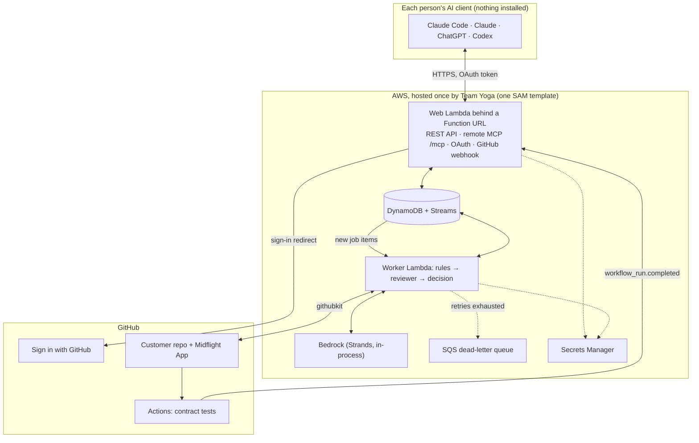
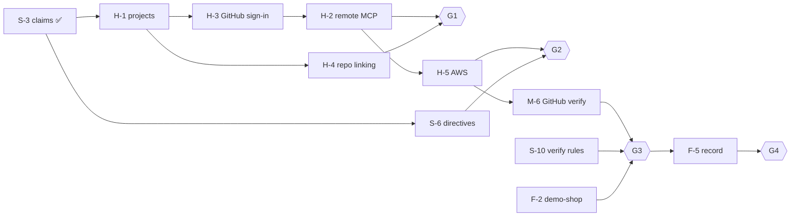

# Midflight development plan

Version 0.3 · October 9, 2026 · Owner: Somesh Agrawal (lead)

This is the build plan from today to submission. It is written for both people and
coding agents. If you are a coding agent, read [AGENTS.md](../AGENTS.md)
before you start any task.

- **Plan to finish:** Saturday, October 10, 2026. **Buffer and submission:** Sunday,
  October 11 (official cutoff still to confirm).
- **What we build:** a **hosted service** (D16–D20). Team Yoga runs one Midflight
  backend and one public GitHub App for every team. A team's lead installs the App on
  their repo and adds Midflight to their AI client as a connector; teammates add the
  same connector and join with a code. The behavior is [use-cases.md](use-cases.md)
  (UC-01 to UC-16).
- **What "done" means:** [requirements.md §12](requirements.md#12-definition-of-done).

**Changed October 8 (version 0.2):** the local, clone-and-run setup became a hosted
connector with GitHub sign-in and join codes. Everything built so far stays: the rules,
the review, claims, check-in, and directives move behind a remote MCP endpoint. New
tasks are H-1 to H-5. The local adapter and seeded tokens are now development tools.

**Changed October 9 (version 0.3):** deployed to AWS, and every code task is built:
plan-change directives, escalations, the Bedrock reviewer, GitHub verification, stale
handling with a fault switch, the pre-push hook, and CI. What's left is people's work:
the demo-shop repo (F-2), the GitHub App's webhook settings, Bedrock access for the AWS
account, the eval (S-8), and the video.

## What a customer does

Nobody clones Midflight, runs a server, or creates a GitHub App.

| Who | Steps |
| --- | --- |
| **Lead** | 1. Installs the **MidFlight Team Yoga** GitHub App on the repo (one click on GitHub). 2. Adds Midflight to their AI client: Claude Code `claude mcp add --transport http midflight <url>/mcp`, or **Add custom connector** in Claude or ChatGPT (Developer Mode). 3. Signs in with GitHub when asked. 4. Tells the agent "create a Midflight project for `acme/shop`" and gets a join code. 5. Writes the plan and assigns tasks by talking to the agent. |
| **Teammate** | 1. Adds the same connector URL. 2. Signs in with GitHub. 3. Tells the agent "join Midflight project `MF-XXXX-XXXX`". |
| **Everyone** | Works as before: agents claim, check in, and answer directives; every PR on the repo gets `midflight/verify`. |

## What Team Yoga does once

1. Deploy the backend to AWS (H-5). The Function URL is the connector URL.
2. Make the GitHub App public, give it a client secret and callback URLs for sign-in,
   and point its webhook at the backend (see [Human steps](#human-steps)).
3. For the demo: create the demo project in `MidFlightt/midflight-demo-shop` the same way
   any customer would.

## Team and roles

| Person | Role | Owns | Reviews |
| --- | --- | --- | --- |
| **Somesh** | Lead, programmer | Domain, services, hosted product (H-tasks), AI reviewer, evals | Mithilesh's PRs |
| **Mithilesh** | Programmer | CI, hooks, AWS template, GitHub App verification | Somesh's PRs |
| **Frederik** | Demo and story lead | Demo-shop repo, acceptance runs, video, submission | Docs and demo PRs, plus a user's-eye check of every gate |

Frederik's work is on the critical path. The demo-shop repo is the stage every
scenario plays on, and his acceptance runs are how we know a gate passed.

## Decisions

All decisions live in [design-decisions.md](design-decisions.md): D1–D10 from the
kickoff, D11–D15 from the consistency pass, and D16–D20 for the hosted product.
Open: D7 (Bedrock access for the AWS account) and D9 (video rules).

## Architecture baseline

Every external dependency sits behind a port with a fake, so the whole system runs and
tests on a laptop.



| Port | Local / test adapter | Cloud adapter |
| --- | --- | --- |
| `Store` | `MemoryStore` | `DynamoStore` (conditional writes, transactions) |
| `JobRunner` | `InlineRunner` (runs the job immediately) | DynamoDB Stream → worker Lambda |
| `Reviewer` | `FakeReviewer` (scripted findings) | `BedrockReviewer` (Strands, structured output) |
| `GitHub` | `FakeGitHub` (recorded payloads, fake login) | `GitHubApp` (githubkit: App auth and user sign-in) |
| `Clock` | `FixedClock` | system clock |

Libraries: Python 3.12, uv, Pydantic v2, FastAPI, MCP Python SDK 2 (`MCPServer`,
streamable HTTP, OAuth server), Strands Agents, boto3, githubkit, Powertools for AWS
Lambda (logging, idempotency), pytest, moto, respx, ruff, AWS SAM.

## Repository layout and ownership

Owners merge into their own directories. Changes to `domain/models.py` or `ports.py`
need **both** programmers' approval, because everything depends on them.

```
midflight/
  AGENTS.md, CLAUDE.md                  entry point for agents and people
  pyproject.toml, uv.lock               M
  .github/workflows/ci.yml              M  (M-1)
  midflight/
    domain/                             S  models, states, rules, impact, decide
    ports.py                            S  Store, JobRunner, Reviewer, GitHub, Clock
    services/                           S  claims, review, plans, check_in, directives,
                                           participants, projects (H-1), escalations,
                                           verify, audit, errors
    adapters/memory_store.py, runners.py, clock.py, fake_reviewer.py, fake_github.py   S
    adapters/bedrock_reviewer.py        S
    adapters/dynamo_store.py            M
    adapters/github_app.py              M  App auth, user sign-in, checks
    api/app.py                          S  REST routes
    api/oauth.py                        S  OAuth server, Sign in with GitHub (H-3)
    mcp/hosted.py, instructions.py      S  hosted MCP connector and its tools (H-2)
    mcp/replies.py                      S  the text agents read
    mcp/local/                          S  local stdio adapter (development tool)
    main.py, config.py                  S  wires the server together; settings
    aws/worker.py                       M  the worker Lambda (H-5)
    worker/handler.py                   M
    hooks/pre_push.py                   M
    demo.py                             S  demo plan for tests and local runs
    claims.py, __main__.py              (prototype; delete)
  tests/unit/, tests/scenarios/         owner of the code under test
  evals/                                S
  infra/template.yaml                   M
docs/                                   F reviews wording; S approves content
```

The demo-shop repository (`MidFlightt/midflight-demo-shop`, separate repo) is owned by F.

## Phases and gates

Each gate is a demo that must work before moving on. Frederik runs each gate as a user
and records it, so we always have footage, even of rough builds.

| Gate | When | Passes when |
| --- | --- | --- |
| **G0 Foundations** | Wed Oct 7 | ✅ Decisions settled, models and ports merged. |
| **G1 Hosted flow, locally** | Fri Oct 9, midday | On one laptop against `http://127.0.0.1:8000/mcp`: Claude Code adds the connector and signs in; the lead creates a project for demo-shop (App installation checked) and approves plan v1; a teammate joins with the code; T2 claims `total` and gets `needs_revision` with the `total_cents` correction **in the same call**, revises, and is approved. |
| **G2 Live, change reaches agents** | Fri Oct 9, night | Deployed on AWS. Teammates on their own laptops add the connector URL, sign in, and join. The lead approves plan v2 (`currency`): T1 and T2 get directives, T3 gets nothing. |
| **G3 Verify on GitHub** | Sat Oct 10, midday | Real push to demo-shop: `midflight/verify` fails for a missing field, then passes after the fix. Stale simulation and duplicate webhook behave correctly. |
| **G4 Ship** | Sat Oct 10, night | Final demo recorded, backup recording saved, submission draft complete. |
| Buffer | Sun Oct 11 | Fix, re-record if needed, submit. |

If AWS still isn't verified by Friday afternoon, G2 runs the same backend from a laptop
behind a public HTTPS tunnel, clearly labeled, and the AWS deploy moves to Saturday.

## Tasks

Task IDs: **S-** Somesh, **M-** Mithilesh, **F-** Frederik, **H-** hosted product
(Somesh). Each task is one branch and one PR, named `<id>-<slug>`.

### Done (October 7–9)

| ID | Task | Status |
| --- | --- | --- |
| S-0 | Kickoff decisions D1–D10, consistency pass D11–D15 | ✅ |
| S-1 | Models, states, ports | ✅ merged |
| S-2 | Claim rules and plan validation | ✅ PR #1 |
| S-3 | Claim service, `MemoryStore`, runners, clock, reviewer-reply checking (INV-01) | ✅ PR #2 |
| S-4 | YAML scenarios and the scenario trace page | ✅ PR #3 |
| M-2 | REST API: token auth, plans, claims, jobs, check-in, directive answers | ✅ PR #4 |
| M-3 | Local stdio MCP adapter (now a development tool, D20) | ✅ PR #5 |
| M-1 | Scaffold and CI (`.github/workflows/ci.yml`: ruff, format check, pytest) | ✅ |
| H-1 | Projects, join codes, members | ✅ built and tested (branch `H-hosted-connector`) |
| H-2 | Hosted MCP connector (`/mcp`) | ✅ built and tested |
| H-3 | Sign in with GitHub (OAuth), local dev login | ✅ built; tested end to end over HTTP with the dev login and against a fake GitHub |
| H-4 | Repo checks (App installed, caller is admin) | ✅ built; tested against a fake GitHub |
| H-5 | AWS: DynamoDB store, worker Lambda, SAM template, packaging | ✅ deployed October 9 ([infra/README.md](../infra/README.md#the-live-deployment)); a real Claude Code sign-in created a project on it |
| S-6 | Plan-change directives (in the approval's own commit) | ✅ currency scenario: T1 and T2 get one directive each, T3 nothing |
| S-7 | Escalations and `resolve_escalation` | ✅ tax conflict escalates; clarify, revise, and dismiss all audited |
| S-5 | `BedrockReviewer` (Converse API with a forced tool, D21) | ✅ built and tested with a fake client. **Live call blocked:** Bedrock answers "Operation not allowed" for every model on this new account (see Human steps), so the deploy runs rules only |
| M-6 | GitHub webhook and the App client (httpx instead of githubkit) | ✅ tested against a fake GitHub; needs the App's webhook settings to run live |
| S-10 | Verify rules, re-check before publishing, correction directive | ✅ false completion (`total` instead of `total_cents`) fails with evidence |
| M-7 | Stale handling and the demo fault switch (`simulate_github_outage`) | ✅ directives held and approvals paused while stale, released on recovery |
| M-4 | Pre-push hook served by Midflight, `hook_setup` tool, `push-check` | ✅ the real script is tested: blocks on 409, warns and allows when unreachable |

### Friday, October 9: hosted product (G1, G2)

| ID | Owner | Task | Depends on | Use cases | Done when |
| --- | --- | --- | --- | --- | --- |
| H-1 | Somesh | Projects and members: `User` (a GitHub account), project name and join code, `create_project`, `join_project`, `assign_task`, `remove_member`, `rotate_join_code`; the creator is the lead; one participant per (user, project) | S-3 | UC-01 | Service tests: create, join with a code, wrong code refused, only the lead assigns tasks, a member of one project can't see another |
| H-2 | Somesh | Remote MCP endpoint at `/mcp` in the web app (stateless, JSON responses). Tools call the services directly. Agent tools: `check_in`, `submit_claim`, `acknowledge_directive`. Project tools: `my_projects`, `create_project`, `join_project`. Lead tools: `project_status`, `propose_plan`, `approve_plan`, `assign_task`. Same D10 instructions | H-1, H-3 | UC-01–04, 07, 09 | An MCP client over HTTP runs the G1 flow; tool replies match the local adapter's text |
| H-3 | Somesh | OAuth server for the MCP endpoint (discovery metadata, dynamic client registration, PKCE, opaque hashed tokens with refresh) with **Sign in with GitHub** through the App's user authorization; local dev login only with `MIDFLIGHT_DEV_LOGIN=1` | H-1 | UC-01, UC-02 | Claude Code against localhost: add connector, browser sign-in, tools work; a request without a token gets 401 with the discovery header |
| H-4 | Somesh | Repo linking: `create_project` checks the App is installed on the repo and that the signer has admin on it; stores the installation id | H-1, H-3 | UC-01 | Refused with a clear fix when the App isn't installed or the user isn't an admin |
| H-5 | Mithilesh (Somesh until he's back) | AWS: SAM template with the web Lambda and Function URL, worker Lambda on the DynamoDB stream, single-table DynamoDB, DLQ, Secrets Manager, least-privilege roles, reserved concurrency, log retention; `DynamoStore` with moto tests; deploy | H-2, H-3, D7 | NFR-01–11 | `sam deploy` from a clean clone; Claude Code on another laptop connects to the Function URL and runs G1 |
| S-6 | Somesh | Plan change directives: approve v2, affected tasks, directives keyed per D13, supersede, revalidation | S-3 | UC-03, 08 | Currency scenario: directives for T1 and T2, none for T3, no duplicates |
| S-5 | Somesh | `FakeReviewer` and `BedrockReviewer` (Strands, structured output) | D7 | UC-05 | One real Bedrock call returns a validated finding |
| F-2 | Frederik | `midflight-demo-shop` contents: checkout API, checkout page, contract tests, `contract.yml` that restores tests from `main` (NFR-10) and uploads `contract-results` with the head SHA, CODEOWNERS | — | UC-10 | Workflow green on `main`; a wrong field makes it red |
| M-1 | Mithilesh | CI: `.github/workflows/ci.yml` running ruff and pytest on every PR | — | — | Green on `main` |

### Saturday, October 10: verify and ship (G3, G4)

| ID | Owner | Task | Depends on | Use cases | Done when |
| --- | --- | --- | --- | --- | --- |
| M-6 | Mithilesh | GitHub webhook (signature check, delivery dedupe, `workflow_run` trigger, routes by installation id to its project), githubkit fetch of head, diff, contents, and test artifact, check-run publishing | H-4, H-5 | UC-10, 11 | Real push produces `midflight/verify`; invalid signature returns 401 |
| S-10 | Somesh | Verify rules, reviewer pass, re-check of head and plan, correction directive (`source: verification`) | S-2, S-5 | UC-10 | False-completion scenario fails with evidence |
| S-7 | Somesh | Escalations, with a lead tool `resolve_escalation` | S-3, H-2 | UC-12, 13 | Tax-inclusive vs tax-exclusive escalates and resolves with audit |
| M-7 | Mithilesh | Stale and reconcile, plus a labeled fault switch for the demo | M-6 | UC-15 | Directives held while stale, released on recovery |
| M-4 | Mithilesh | Pre-push hook using a personal hook token from a `hook_setup` tool | H-2 | UC-16 | Push blocked while a directive is unanswered |
| S-8 | Somesh | Eval harness: about 20 labeled cases, recall, unnecessary blocks, latency, tokens | S-5 | UC-05 | Table in `evals/results.md`; model chosen |
| F-5 | Frederik | Record the final demo and a full backup take; edit, captions | G3 | all | Video exported; backup saved |
| F-6 | Frederik | Submission: write-up, architecture visual, measured results, screenshots | F-5, S-8 | — | Draft reviewed by Somesh |

### Stretch, only after G3

| ID | Owner | Task |
| --- | --- | --- |
| X-1 | Mithilesh | Host the reviewer on AgentCore Runtime behind the same `Reviewer` port |
| X-2 | Somesh | Contract proposal flow for two unlinked claims |
| X-3 | Frederik | Read-only project status page served by the backend |
| X-4 | Somesh | Tracked checkpoints (needs a new `Claim` field) |
| X-5 | Somesh | Submit Midflight to the Claude and ChatGPT connector directories (one-click Connect) |
| X-6 | Mithilesh | Claude Code plugin bundling the connector and a check-in hook |

## Critical path



## If we fall behind: cut in this order

1. The pre-push hook (M-4). Directives still ride on every reply.
2. AI reviewer inside verification. Rules and contract tests decide.
3. Live GitHub outage. Use the labeled fault switch.
4. ChatGPT in the demo. Claude Code alone shows the connector.

**Never cut:** the connector with sign-in and join code, the `total_cents` conflict
caught before coding, the false-completion failure on GitHub, human escalation, and
the stale path.

## Human steps

Steps only a person with the accounts can do. Somesh does them unless noted.

**AWS (needed for H-5 and S-5):**

1. Wait for the account to finish verification (email from AWS).
2. Turn on MFA for the root user, and stop using root after step 4.
3. Create a $25/month budget with an email alert (Billing → Budgets).
4. Create a deploy identity: IAM Identity Center user with AdministratorAccess on this
   account (preferred; no long-lived keys), or an IAM user with MFA and an access key.
5. Install AWS CLI v2 and the SAM CLI, then sign in: `aws configure sso` (or
   `aws configure` for an access key). Region `us-east-1`.
6. ~~Deploy~~ Done October 9 ([infra/README.md](../infra/README.md)).
7. **Bedrock access (still open).** Every Bedrock call from this account answers
   `ValidationException: Operation not allowed`, for Claude and for Amazon's own models,
   so AWS hasn't enabled Bedrock for the new account yet. Open a free support case:
   Support Center → Create case → Account and billing → "Please enable Amazon Bedrock
   model invocation for account 376564125271 in us-east-1." When a playground message
   works, redeploy with `ReviewerModel=us.anthropic.claude-sonnet-5-5`.
8. Request a Lambda concurrency increase to 1,000 in `us-east-1` (Service Quotas →
   AWS Lambda → Concurrent executions). New accounts allow 10.

**GitHub App settings:**

1. Advanced → **Make public**, so other accounts can install it.
2. General → **Generate a new client secret** (used for Sign in with GitHub). Keep it in
   a password manager.
3. General → Callback URLs: add `http://127.0.0.1:8000/oauth/github/callback` now, and
   `<Function URL>/oauth/github/callback` after the deploy.
4. After the deploy: Webhook → **Active**, URL `<Function URL>/github/webhook` (the
   stack output `GitHubWebhookUrl`), and the webhook secret that's in your `.env`.
5. Permissions: **Checks: read and write**; **Actions, Contents, Pull requests,
   Metadata: read**. Subscribe to the **Workflow run** event. Accept the new permissions
   on the installation if GitHub asks.

## Working agreements

- **Trunk-based.** Short branches from `main`, small PRs, merge the same day.
- **Every PR:** links its task ID and use cases, passes CI (ruff and pytest), and gets
  one review. Use the PR template.
- **Interfaces first.** `models.py` and `ports.py` change only through a PR that both
  programmers approve.
- **Tests come from use cases.** Unit tests never touch AWS, GitHub, or Bedrock; use the
  fakes.
- **No secrets in git.** Real values live in Secrets Manager or a local `.env`
  (git-ignored).
- **Commits.** Conventional style with the task ID in the body.

## Rules for coding agents

The rules, commands, ownership, and source-of-truth order for coding agents are in
[AGENTS.md](../AGENTS.md). Names, states, and invariants are in
[domain.md](domain.md).

## Demo storyboard

A draft for F-1. Check D9 for the real length limit.

| Time | Scene | Use cases | Shows |
| --- | --- | --- | --- |
| 0:00 | The problem: two agents, one contract, and drift nobody sees until merge | — | Two terminals side by side |
| 0:15 | Setup in 20 seconds: install the App, paste the connector URL, sign in with GitHub, "create a project", share the join code, a teammate joins | UC-01, 02 | No cloning, no servers |
| 0:40 | The lead writes plan v1 by talking to the agent; T2 expects `total` and gets the correction in the same call; it revises | UC-03, 04, 05, 06 | Conflict caught before coding |
| 1:10 | Lead adds `currency`; the directive appears at each agent's next step; T3 stays quiet | UC-03, 08, 07 | Scoped propagation |
| 1:35 | T1's agent says "done", but the code is wrong; `midflight/verify` fails with evidence | UC-10, 11 | Diff over claims |
| 2:00 | Fix, push, green check; the timeline explains every step | UC-14 | Audit trail |
| 2:20 | Quick cuts: stale banner, injection text ignored, same connector in ChatGPT | UC-15 | Safety and reach |
| 2:40 | Architecture in one picture and measured results | — | AWS stack and eval table |
