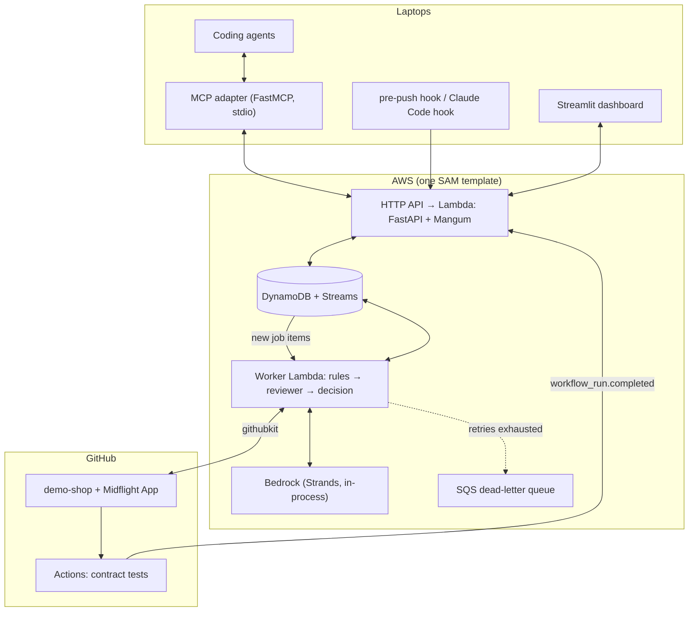
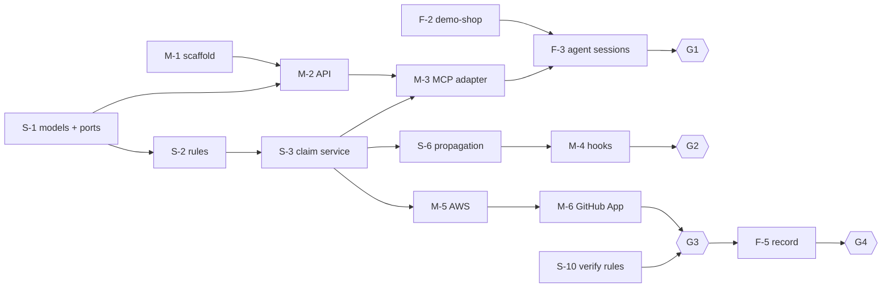

# Midflight development plan

Version 0.1 · October 7, 2026 · Owner: Somesh Agrawal (lead)

This is the build plan from today to submission. It is written for both people and
coding agents. If you are a coding agent, read [AGENTS.md](../AGENTS.md)
before you start any task.

- **Plan to finish:** Saturday, October 10, 2026. **Buffer and submission:** Sunday,
  October 11 (official cutoff still to confirm).
- **What we build:** the system in [use-cases.md](use-cases.md) (UC-01 to UC-16), on
  the simplified stack in [Architecture baseline](#architecture-baseline).
- **What "done" means:** [requirements.md §12](requirements.md#12-definition-of-done).

## Team and roles

| Person | Role | Owns | Reviews |
| --- | --- | --- | --- |
| **Somesh** | Lead, programmer: the "brain" | Domain models, rules, services, AI reviewer, evals, dashboard | Mithilesh's PRs |
| **Mithilesh** | Programmer: the "plumbing" | Scaffold and CI, API and auth, MCP adapter, hooks, AWS, GitHub App | Somesh's PRs |
| **Frederik** | Demo and story lead | Demo-shop repo, agent sessions, acceptance runs, video, submission | Docs and demo PRs, plus a user's-eye check of every gate |

Frederik's work is on the critical path. The demo-shop repo is the stage every
scenario plays on, and his acceptance runs are how we know a gate passed.

## Kickoff decisions (October 7, 30 minutes, everyone)

Settle these before writing code. If nobody objects, the default applies.

| ID | Decision | Default | Affects |
| --- | --- | --- | --- |
| D1 | ~~Do the hackathon rules require AgentCore Runtime?~~ | **Decided Oct 7: not required.** The reviewer runs inside the worker Lambda. | S-5, M-5 |
| D2 | Canonical plan change for the demo | Add `currency` to `checkout-response` | F-2, scenarios |
| D3 | MCP tools | `submit_claim` (waits for verdict; `status: withdrawn` to withdraw), `check_in`, `acknowledge_directive` | M-3, FR-07 |
| D4 | Verification trigger | `workflow_run.completed` for the contract-test workflow | M-6 |
| D5 | Incomplete claims | Accept as draft; withhold approval until interfaces and criteria exist | S-3 |
| D6 | The two demo coding-agent hosts | Two Claude Code sessions | M-4, F-3 |
| D7 | AWS account, region, Bedrock model access | Somesh confirms today; pick a region with current Claude models | S-5, M-5 |
| D8 | Pre-push hook behavior when Midflight is down | Warn and allow; the GitHub check still verifies | M-4 |
| D9 | Video length and submission format | Check rules today; plan for 3 minutes | F-1, F-5 |
| D10 | How agents sync while they implement | **Decided Oct 7: agent-planned checkpoints.** The MCP adapter's instructions tell agents to list assumptions in the claim, `check_in` at the critical points of their task, and revise the claim when an assumption or their scope changes | M-3, FR-07 |

A consistency pass the same evening added defaults D11–D15: closing a claim
(`status: closed`), claims with no interfaces (`no_interfaces`), directive sources and
dedupe, escalation state transitions, and one REST path table in
[domain.md](domain.md#rest-api).

The outcomes live in [design-decisions.md](design-decisions.md). FR-07 in
[requirements.md](requirements.md) and the MCP row in [architecture.md](architecture.md)
already reflect the D3 default; S-0 updates them only if the kickoff changes it.

## Architecture baseline

The simplified architecture proposed in review. Every external dependency sits
behind a port with a fake, so the whole system runs and tests on a laptop.



| Port | Local / test adapter | Cloud adapter |
| --- | --- | --- |
| `Store` | `MemoryStore` | `DynamoStore` (conditional writes, transactions) |
| `JobRunner` | `InlineRunner` (runs the job immediately) | DynamoDB Stream → worker Lambda |
| `Reviewer` | `FakeReviewer` (scripted findings) | `BedrockReviewer` (Strands, structured output) |
| `GitHub` | `FakeGitHub` (recorded payloads) | `GitHubApp` (githubkit) |
| `Clock` | `FixedClock` | system clock |

Libraries: Python 3.12, uv, Pydantic v2, FastAPI, Mangum, MCP Python SDK
(FastMCP), Strands Agents, boto3, githubkit, Powertools for AWS Lambda
(logging, idempotency), Streamlit, pytest, moto, respx, ruff, AWS SAM.

## Repository layout and ownership

Owners merge into their own directories. Changes to `domain/models.py` or `ports.py`
need **both** programmers' approval, because everything depends on them.

```
midflight/
  AGENTS.md, CLAUDE.md                  entry point for agents and people
  pyproject.toml, uv.lock               M  (M-1)
  .github/workflows/ci.yml              M  (M-1)
  midflight/
    domain/models.py                    S  every entity and enum in docs/domain.md
    domain/rules.py                     S  contract fields, references, file overlap, verify rules
    domain/impact.py                    S  plan diff, affected tasks
    domain/states.py                    S  allowed state transitions
    ports.py                            S  Store, JobRunner, Reviewer, GitHub, Clock protocols
    services/                           S  claims.py, plans.py, directives.py, escalations.py, verify.py
    adapters/memory_store.py            S
    adapters/fake_reviewer.py           S
    adapters/bedrock_reviewer.py        S
    adapters/runners.py, clock.py       S  InlineRunner, FixedClock, system clock
    adapters/dynamo_store.py            M
    adapters/github_app.py              M
    adapters/fake_github.py             M
    api/                                M  app.py, auth.py, routes
    worker/handler.py                   M
    mcp/server.py                       M
    hooks/pre_push.py                   M
    hooks/claude_check_in.py            M
    dashboard/app.py                    S
    claims.py, __main__.py              (prototype; delete once S-3 lands)
  tests/unit/                           owner of the code under test
  tests/scenarios/*.yaml                S writes, F reviews against use cases
  evals/                                S
  infra/template.yaml                   M
docs/                                   F reviews wording; S approves content
```

The demo-shop repository (`MidFlightt/midflight-demo-shop`, separate repo) is owned by F.

## Phases and gates

Each day ends with a gate: a demo that must work before moving on. Frederik runs
each gate as a user and records it, so we always have footage, even of rough builds.

| Gate | When | Passes when |
| --- | --- | --- |
| **G0 Foundations** | Wed Oct 7, night | Decisions settled. Scaffold and CI green on `main`. `models.py` and `ports.py` merged. Storyboard v1 exists. |
| **G1 Local slice** | Thu Oct 8, night | Two real agent sessions on a laptop: T2 claims `total`, gets `needs_revision` with the `total_cents` correction **in the same call**, revises, gets approved. In-memory store and real or fake reviewer. |
| **G2 Change reaches agents** | Fri Oct 9, night | On deployed AWS: lead approves plan v2 (`currency`). T1 and T2 get directives through `check_in` and the hook, T3 gets nothing, and the pre-push hook blocks until acknowledged. The dashboard shows all of it. The model is chosen from eval numbers. |
| **G3 Verify on GitHub** | Sat Oct 10, midday | Real push to demo-shop: `midflight/verify` fails for a missing `total_cents`, then passes after the fix. Stale simulation and duplicate webhook behave correctly. |
| **G4 Ship** | Sat Oct 10, night | Final demo recorded, backup recording saved, submission draft complete. |
| Buffer | Sun Oct 11 | Fix, re-record if needed, submit. |

## Tasks

Task IDs: **S-** Somesh, **M-** Mithilesh, **F-** Frederik. Each task is one branch
and one PR, named `<id>-<slug>`, for example `S-2-contract-rules`.

### October 7: foundations (G0)

| ID | Owner | Task | Depends on | Use cases | Done when |
| --- | --- | --- | --- | --- | --- |
| S-0 | Somesh | Run kickoff, record decisions D1–D10 in `docs/design-decisions.md`, confirm or change the defaults; update FR-07 and the architecture doc only if D3 changes | — | — | Decisions merged |
| S-1 | Somesh | `domain/models.py`, `domain/states.py`, and `ports.py`: Pydantic models for the entities and enums in [domain.md](domain.md), with field-typed contracts (`fields: {name: type}`), the claim transitions, and the five port protocols | S-0 | all | Merged with Mithilesh's approval; models round-trip to JSON; illegal transitions raise |
| M-1 | Mithilesh | Scaffold: `pyproject.toml` with uv, ruff, pytest, pyyaml, the layout above, `ci.yml` (ruff + pytest on every PR), `.env.example` | — | — | CI green on `main`; `uv run pytest` passes |
| F-1 | Frederik | Storyboard and demo script v1: scenes mapped to use cases, shot list, voice-over draft (see [Demo storyboard](#demo-storyboard)) | — | all | `docs/demo.md` updated in a PR |

### October 8: local slice (G1)

| ID | Owner | Task | Depends on | Use cases | Done when |
| --- | --- | --- | --- | --- | --- |
| S-2 | Somesh | `domain/rules.py`: reference validation, contract field and type match, file overlap as `info` | S-1 | UC-05 | Unit test per rule, including `total` vs `total_cents` |
| S-3 | Somesh | `MemoryStore`, `services/claims.py` (submit, revise, withdraw, check), coordination-revision save, state transitions | S-1, S-2 | UC-04, 05, 06 | Scenario tests pass, including the simultaneous-claims race |
| S-4 | Somesh | Scenario runner: YAML scenarios in `tests/scenarios/` that drive services with fakes | S-3 | UC-01–06 | One YAML per §11 scenario covered so far |
| S-5 | Somesh | `FakeReviewer` and `BedrockReviewer` (Strands, structured output as `Finding`), with schema and cited-ID validation | S-1, D7 | UC-05 | A malformed reply can never approve (test) |
| M-2 | Mithilesh | FastAPI app with in-memory store and `InlineRunner`: bearer-token auth (hashed), roles, and the endpoints in [domain.md](domain.md#rest-api) for participants, plans, claims, jobs, check-in, and directive responses | S-1, M-1 | UC-01, 03, 04, 07 | `TestClient` tests for 401 and 403 and the happy paths |
| M-3 | Mithilesh | MCP adapter: `submit_claim` (polls the job up to 60 s and returns the verdict), `check_in`, `acknowledge_directive`; every reply carries pending directives; the server instructions and tool descriptions carry the checkpoint rules from [domain.md](domain.md#interfaces) (D10) | M-2, S-3 | UC-02, 04, 07, 09 | Works from a real Claude Code session; given a task and no other guidance, the agent lists its assumptions and checkpoints before coding |
| F-2 | Frederik | `midflight-demo-shop` repo: checkout API returning `total_cents`, checkout page, contract tests in `tests/contract/`, `contract.yml` workflow that restores `tests/contract/` from `main` before running (NFR-10) and uploads the `contract-results` artifact with the head SHA, CODEOWNERS on tests and workflows, README | — | UC-10 | Workflow green on `main`; a wrong field makes it red |
| F-3 | Frederik | Two agent sessions (T1 and T2) set up against demo-shop and local Midflight; run G1 and record it | M-3, F-2 | UC-02, 04 | G1 footage saved |

### October 9: change, cloud, dashboard (G2)

| ID | Owner | Task | Depends on | Use cases | Done when |
| --- | --- | --- | --- | --- | --- |
| S-6 | Somesh | `domain/impact.py` and `services/plans.py`: approve, diff, affected tasks, directives keyed by (plan version, task), supersede, revalidation | S-3 | UC-03, 08 | Currency scenario: directives for T1 and T2, none for T3, no duplicates |
| S-7 | Somesh | `services/escalations.py`: escalate and resolve, with original evidence kept | S-3 | UC-12, 13 | Tax-inclusive vs tax-exclusive scenario escalates and resolves with audit |
| S-8 | Somesh | Eval harness: about 20 labeled cases, 3 runs per candidate model, recording recall, unnecessary blocks, latency, tokens | S-5 | UC-05 | Table in `evals/results.md`; model chosen |
| S-9 | Somesh | Streamlit dashboard over the API: tasks, claims, directive delivery states, escalations with resolve actions, stale banner, timeline | M-2, S-6 | UC-13, 14 | Lead can do UC-13 without the terminal |
| M-4 | Mithilesh | `hooks/pre_push.py` and the Claude Code hook that runs `check_in`; install instructions | M-3, S-6 | UC-16, 02, 07 | Push blocked on an unacknowledged directive; hook puts D-42 in the agent's context |
| M-5 | Mithilesh | AWS: SAM template (HTTP API, API Lambda, DynamoDB with streams, worker Lambda with filtered event source, DLQ, Secrets Manager), `DynamoStore` with moto tests, Powertools idempotency, deploy | M-2, S-3 | NFR-01–06 | `sam deploy` works from a clean clone; G1 scenario passes against the cloud URL |
| F-4 | Frederik | Acceptance run sheet: each §11 scenario as a user-level script with expected result; run G2 and record it | S-6, M-4 | all | `docs/acceptance-runs.md` with results and timings |

### October 10: verify and ship (G3, G4)

| ID | Owner | Task | Depends on | Use cases | Done when |
| --- | --- | --- | --- | --- | --- |
| M-6 | Mithilesh | GitHub App: webhook with signature check and delivery-ID dedupe, `workflow_run` trigger, githubkit fetch of head, diff, contents, and test artifact, check-run publishing, outcome mapping | M-5 | UC-10, 11 | Real push produces `midflight/verify`; invalid signature returns 401 |
| S-10 | Somesh | `services/verify.py`: verify rules (declared files, contract fields present, tests passed, tests untouched), reviewer pass, re-check of head and plan, correction directive (`source: verification`, D13) | S-2, S-5 | UC-10 | False-completion scenario fails with evidence |
| M-7 | Mithilesh | Stale and reconcile, plus a labeled fault-injection switch for the demo (simulated rate limit) | M-6 | UC-15 | Stale banner shows, directives held, then released on recovery |
| F-5 | Frederik | Record the final demo following the storyboard; record a full backup take; edit, captions | M-6, S-10 (G3) | all | Video exported; backup saved |
| F-6 | Frederik | Submission: write-up, architecture visual, measured results from S-8 and F-4, screenshots in README | F-5, S-8 | — | Submission draft reviewed by Somesh |

### Stretch, only after G3

| ID | Owner | Task |
| --- | --- | --- |
| X-1 | Mithilesh | Optional, only if everything else is done: host the reviewer on AgentCore Runtime behind the same `Reviewer` port |
| X-2 | Somesh | Contract proposal flow: Midflight proposes a contract for two unlinked claims |
| X-3 | Frederik | Hosted dashboard, if the rules reward a public URL |
| X-4 | Somesh | Tracked checkpoints: agents declare their checkpoints in the claim, `check_in` reports which one was reached, and the dashboard flags an agent that is overdue while a directive waits. Needs a new `Claim` field (both programmers approve). |

## Critical path



S-1 blocks everyone, so it lands first and stays small. If S-1 slips, Mithilesh
starts M-2 against a draft branch of `models.py`, and Frederik is not blocked
at all on day one.

## If we fall behind: cut in this order

1. Claude Code hook. Keep the pre-push hook and directives carried in every reply.
2. AI reviewer inside verification. Rules and contract tests alone decide.
3. Dashboard polish. A plain table is enough.
4. Live GitHub outage. Use the labeled fault-injection switch.

**Never cut:** the G1 conflict caught before coding, the false-completion failure
on GitHub, human escalation, and the stale path. These are the definition of done.

## Working agreements

- **Trunk-based.** Short branches from `main`, small PRs, merge the same day. No
  long-lived feature branches.
- **Every PR:** links its task ID and use cases, passes CI (ruff and pytest), and
  gets one review from the person in the Reviews column. Use the existing PR
  template.
- **Interfaces first.** `models.py` and `ports.py` change only through a PR that
  both programmers approve.
- **Tests come from use cases.** Each alternate path in `use-cases.md` that a task
  implements gets a test or a scenario YAML. Unit tests never touch AWS, GitHub, or
  Bedrock; use the fakes.
- **No secrets in git.** `.env.example` lists names only. Real values live in
  Secrets Manager or local `.env` (gitignored).
- **Sync.** A 10-minute stand-up each morning: what landed, what's blocked, today's
  gate. Gate check each night with Frederik driving.
- **Commits.** Conventional style (`feat:`, `fix:`, `test:`, `docs:`, `chore:`),
  with the task ID in the body.

## Rules for coding agents

The rules, commands, ownership, and source-of-truth order for coding agents are in
[AGENTS.md](../AGENTS.md). Names, states, and invariants are in
[domain.md](domain.md).

## Demo storyboard

A draft for F-1. Check D9 for the real length limit.

| Time | Scene | Use cases | Shows |
| --- | --- | --- | --- |
| 0:00 | The problem: two agents, one contract, and drift nobody sees until merge | — | Two terminals side by side |
| 0:20 | Plan v1 on the dashboard; both agents submit claims | UC-03, 04 | Plan and contract |
| 0:40 | T2 expects `total`; Midflight answers with the correction in the same call; agent revises | UC-04, 05, 06 | Conflict caught before coding |
| 1:10 | Lead adds `currency`; the directive appears in each agent's context at its next step; T3 stays quiet | UC-03, 08, 07 | Scoped propagation |
| 1:35 | T1's agent says "done", but the code is wrong; `midflight/verify` fails with evidence | UC-10, 11 | Diff over claims |
| 2:00 | Fix, push, green check; the timeline explains every step | UC-14 | Audit trail |
| 2:20 | Quick cuts: push blocked by the hook, stale banner, injection text ignored | UC-16, 15 | Safety |
| 2:40 | Architecture in one picture and measured results | — | AWS stack and eval table |
