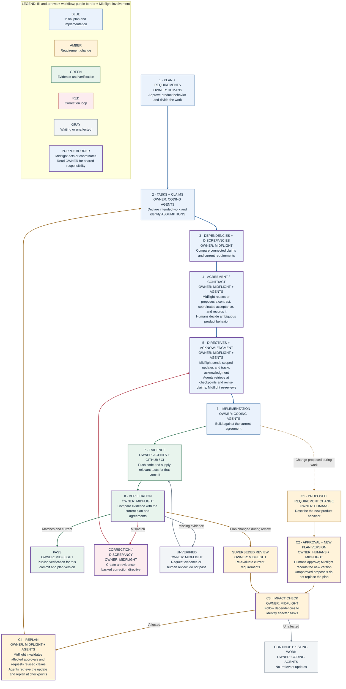
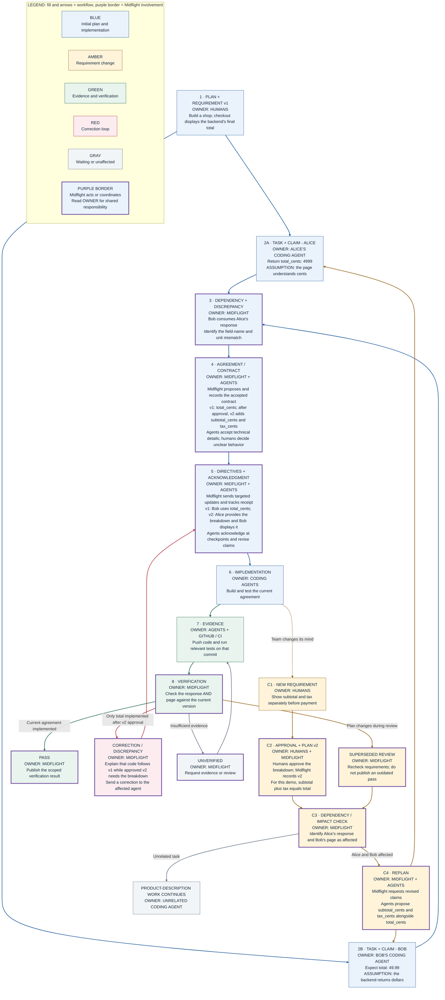

# Midflight: shared vocabulary and coordination workflows

Version: 1.1 | October 6, 2026 | Design reference, not implemented functionality

This document describes the brainstormed coordination service and complements the [open design decisions](design-decisions.md) and [proposed system architecture](../systemarchitecture.md). It does not amend the [draft project requirements](../PROJECT_REQUIREMENTS.md); the documents illustrate different proposed requirement-change examples until the team selects one. The diagrams assume a GitHub-connected project and participating coding agents that consult Midflight at supported checkpoints.

The current prototype only compares declared overlap and asks for clarification; it does not implement the approvals, semantic checks, propagation, or verification below. Claims can begin broad and be refined when dependencies emerge. The detailed checkout claims illustrate a shared interface after discovery, not a requirement to enumerate every implementation detail upfront. See the [README](../README.md) for current capabilities.

## Shared vocabulary

| Term | Definition | Checkout example |
| --- | --- | --- |
| Plan | The team's approved product direction and division of work; versioned as decisions change. | Build an online shop; Alice builds the backend and Bob builds the checkout page. |
| Requirement | A specific behavior the product must satisfy. | Display the total calculated by the backend. |
| Task | A piece of work assigned to a person and their coding agent. | Build the checkout page. |
| Claim | An agent's declaration of how it intends to perform a task; intention, not completion. | The page will read `total` as a decimal dollar amount. |
| Assumption | A detail relied on but not yet established by the plan, authoritative code, or an agreement. | The backend will return a field named `total`. |
| Dependency | Something one task needs from another task or existing component. | The page consumes the checkout response. |
| Agreement / contract | A recorded decision about how connected components must work together. | Return `total_cents` as an integer; convert it for display. |
| Discrepancy | A mismatch between connected claims, or between implementation and an approved decision. | The page expects `total`; the backend returns `total_cents`. |
| Directive | A scoped update to an affected agent based on an approved requirement or agreement. | Read `total_cents` and update the mock response. |
| Evidence | Observable information about the implementation. | Pushed code and tests tied to the reviewed commit. |
| Verification | Comparing evidence with the current requirements, claims, and agreements. | Check that the backend and page use the agreed price format. |

An assumption is not automatically an error. Different local variable names are usually harmless; incompatible expectations at a shared boundary are the concern.

## Legend and reading guide

Color identifies the **workflow**, not the actor. The owner label inside every node identifies **who performs the action**. A purple border additionally highlights nodes where **MIDFLIGHT** has a direct role; shared labels identify shared responsibility.

| Color | Workflow | What to follow |
| --- | --- | --- |
| Blue | Initial planning and implementation | Plan, claims, comparison, agreement, delivery, and building. |
| Amber | Requirement change | Proposal, human approval, impact analysis, and replanning affected work. |
| Green | Evidence and verification | Collect implementation evidence, review it, and publish a scoped pass. |
| Red | Correction loop | An evidenced mismatch produces a correction directive and another implementation attempt. |
| Gray | Waiting or unaffected work | Missing evidence remains unverified; unrelated work continues. |

- **MIDFLIGHT owner label + purple outline:** Midflight executes or coordinates this stage.
- **HUMANS:** own product decisions and approve requirement changes.
- **CODING AGENTS:** declare, accept technical agreements under team policy, acknowledge, and implement.
- **GITHUB / CI:** supply repository events, commit-specific code, and test evidence.
- **Shared owner labels:** each actor has a distinct part; for example, humans approve a change and Midflight records the new version.
- **Numbered stages 1-8:** normal coordination and verification. **C1-C4:** requirement-change path, available at any time.
- **Solid arrows:** process flow or update delivery. **Dashed arrows:** a possible change during work. **Arrow labels:** outcomes and return paths.
- Acknowledged means received, not implemented. Verified covers checked behavior, not the entire app.

## Where Midflight comes in

| Stage | Midflight's responsibility | Responsibility retained elsewhere |
| --- | --- | --- |
| 3: Compare | Map dependencies, inspect claims and known interfaces, and identify discrepancies or unresolved assumptions. | Agents must report their intentions; Midflight cannot see unreported local plans. |
| 4: Create an agreement | Reuse an authoritative contract if one exists; otherwise propose a shared contract, coordinate acceptance, and record the agreed version. | Agents accept technical details under team policy. Humans resolve ambiguous product behavior. A proposal is not an agreement until accepted. |
| 5: Deliver updates | Create scoped directives, expose them at checkpoints, track acknowledgment, and re-review revised claims. | Coding agents retrieve, acknowledge, and implement; Midflight does not write their code or force an immediate interruption. |
| C2: Record approval | Record the human-approved change as a new plan version. | Humans approve the product change. |
| C3-C4: Propagate change | Find affected tasks, invalidate obsolete approvals, request revised claims, and leave unrelated work alone. | Agents replan and pick up updates at their next checkpoint. |
| 8: Verify | Compare evidence with current decisions and publish a scoped result. | GitHub/CI supply evidence; passing does not prove every behavior works. |
| Correction and waiting | Explain an evidenced mismatch, issue a correction directive, or keep a review unresolved when evidence is missing. | Agents correct the code; humans review unresolved questions when needed. |

## Flowchart 1: workflow with definitions

Read the normal path first. Follow C1-C4 when a requirement changes. Affected tasks return to claim review; unrelated work continues.



## Flowchart 2: checkout example with labeled categories

The team starts with a normal plan that does not define every interface detail. Both agents can follow its intent while independently filling the same gap differently. For this demo, monetary amounts are USD integer cents; currency-general conversion is outside the example.



The v1 fields in stages 2A and 2B describe the first pass. On a C4 return, replace those claims with revisions targeting v2; do not recreate the original assumptions. The applicable v2 agreement is established before v2 directives are delivered.

## Demo fixtures

### Before coordination

Alice proposes this response:

```json
{"total_cents": 4999, "currency": "USD"}
```

Bob independently mocks this response:

```json
{"total": 49.99, "currency": "USD"}
```

Different files can merge cleanly even though these expectations are incompatible. Tests built around each agent's own mock may also pass independently.

### After the approved requirement change

An example response satisfying the v2 agreement:

```json
{"subtotal_cents": 4500, "tax_cents": 499, "total_cents": 4999, "currency": "USD"}
```

The page should show subtotal $45.00, tax $4.99, and total $49.99. These are synthetic amounts for an interface demonstration, not tax guidance. Verification should check both response values and the consumer's behavior; the presence of fields alone is insufficient.

## Implementation rules for agents

1. **Preserve authority.** A generated proposal is not an approved requirement. Follow existing authoritative interfaces when present. Escalate ambiguous product decisions to people.
2. **Make declarations explicit.** GitHub reveals pushed code, not an agent's unreported plans. Claim and checkpoint integration is necessary for pre-implementation coordination.
3. **Version decisions.** Bind claims, agreements, directives, evidence, and reviews to their versions. Revalidate before publishing a result if the plan, dependent agreements, or reviewed commit changed.
4. **Coordinate affected work only.** Use dependencies to select recipients. Do not pause all unrelated work merely because one requirement changed.
5. **Respect checkpoint limits.** No universal live interruption is assumed. Mark an update as pending until the agent retrieves and acknowledges it. Do not claim stale local work has stopped automatically.
6. **Separate delivery from completion.** Queued, acknowledged, implemented, and verified are different states. An acknowledgment alone cannot pass verification.
7. **Review changed claims.** Material claim revisions must pass the comparison stage before approval. The diagrams compress this internal re-review to keep the main path readable.
8. **Use evidence for corrections.** A completion message is not proof. Cite the affected requirement/agreement and actual evidence when reporting a discrepancy.
9. **Fail honestly.** Missing or stale evidence means unverified. On GitHub errors, suspend dependent approvals/directives until fresh state is available; show the limitation if an existing GitHub check cannot be updated.
10. **Keep action authority outside model text.** Validate structured outputs and permissions in application code. Directives are data for the receiving agent, not arbitrary executable commands.
11. **Scope the claim.** A passing review covers checked behavior at a particular commit and plan version. It does not establish overall application correctness.

## Legend for ownership

- **Humans:** approve product intent, requirement changes, and unresolved product tradeoffs.
- **Coding agents:** propose implementation details, declare assumptions, acknowledge directives, and write code/tests.
- **Midflight:** compare declarations, track dependencies and versions, coordinate agreements, deliver scoped updates, and verify evidence.
- **GitHub / CI:** supply pushed-code events, commit-specific evidence, test results, and the check surface.

## Demonstration success conditions

- A sensible initial plan exists before any agent starts.
- Midflight catches the initial field-name/unit discrepancy before substantial implementation.
- Agents establish and implement a shared v1 agreement.
- A human-approved mid-build requirement change creates v2.
- Alice and Bob receive targeted updates; an unrelated task continues.
- An implementation that only satisfies v1 cannot pass review against v2.
- Corrected implementation and supporting tests pass the applicable v2 checks.
- The UI distinguishes update delivery from verified implementation.
