# Midflight use cases

Version 0.2 · October 7, 2026 · Draft for team review

This document lists who uses Midflight, what each actor is trying to get done, and
what the system does in normal and failure cases. Each use case cites the
[draft requirements](requirements.md) (FR/NFR IDs). Every alternate path
is a candidate test case.

Examples use the checkout demo project:

| Task | Owner | Role in the contract `checkout-response` |
| --- | --- | --- |
| T1 Checkout API | Somesh's agent | Provider |
| T2 Checkout page | Frederik's agent | Consumer |
| T3 Contributor guide | Mithilesh's agent | None (unrelated) |

Plan v1 defines `checkout-response { total_cents: integer }`. Plan v2 adds
`currency: string`.

## Actors

| Actor | Kind | Goal |
| --- | --- | --- |
| Integration Lead | Primary, human | Owns the plan, approves changes, resolves escalations, watches the dashboard. |
| Developer | Primary, human | Owns a task, connects their coding agent, reads its status. |
| Coding Agent | Primary, software | Claude Code, Cursor, and so on. Calls Midflight through the local MCP adapter. |
| GitHub | Supporting system | Sends signed events, serves diffs and CI results, displays the check. |
| AI Reviewer | Supporting system | A Bedrock model. Proposes findings and never decides an outcome. |

## Use case diagram

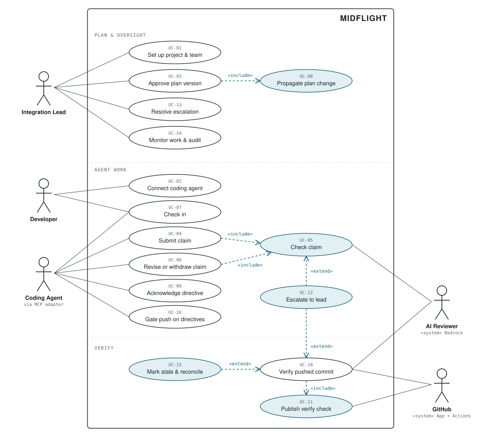

White ellipses are actor goals: someone starts them. Shaded ellipses are internal
steps: they run as part of another use case, or only under a condition. «include»
always happens; «extend» happens only when its condition is met.

Not drawn, to keep the diagram readable: UC-12 also extends UC-08 when a change's
impact is unclear, and UC-15 also extends UC-08 by holding directives while GitHub
data is stale.

## How Midflight reaches a coding agent

Midflight cannot speak first. A coding agent only takes in what its user types, the
replies to tool calls it makes, and context its host injects (such as Claude Code
hooks). An MCP server only answers calls. Every message from Midflight therefore
travels inside a reply to something the agent, or a hook acting for it, called.

The design uses this constraint instead of fighting it:

1. **The claim answer comes back in the same call.** `submit_claim` waits for the
   review, up to about 60 seconds, and returns the verdict, the agreed contract,
   and any correction. The agent does not poll for its own review. Only a review
   that runs past the limit returns `pending`.
2. **Every Midflight reply carries pending directives.** Whichever tool the agent
   calls, the reply includes any unacknowledged directive for its task.
3. **`check_in` replaces `get_task_context` and `get_directives`.** It returns only
   what changed since the agent's last check-in. Agents call it at checkpoints
   they plan themselves at the critical points of their task (see below).
4. **A host hook checks in automatically where the host supports it.** In Claude
   Code, a hook runs `check_in` after tool calls or on each prompt and adds new
   directives to the agent's context. This is the closest thing to a push.
5. **A git pre-push hook is the backstop.** It refuses the push while a blocking
   directive is unacknowledged or the claim is not approved. This works with any
   agent host.

**Agent-planned checkpoints (decision D10).** When an agent connects, the adapter's
instructions tell it to list its assumptions in the claim, then plan checkpoints at
the critical points of its task: before it first builds on a contract or shared
interface, whenever it makes a new assumption or its scope grows, and before it
pushes. At each one it calls `check_in`. If an assumption or its scope changed, it
submits a revised claim (UC-06) and waits for the verdict before building on it. This
is how assumptions get cleared while the work is in progress, not after the push. It
is guidance the agent follows; the hooks above are still the enforcement. Exact
wording: [domain.md](domain.md#interfaces).

Delivery latency is "until the agent's next call or hook run", not instant. When an
agent is idle waiting for its developer, nothing reaches it until the developer
types. The dashboard shows each directive's delivery state so the lead can follow up.

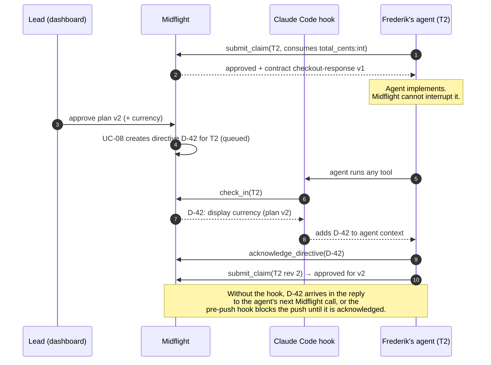
```mermaid
sequenceDiagram
    autonumber
    participant L as Lead (dashboard)
    participant M as Midflight
    participant H as Claude Code hook
    participant A as Frederik's agent (T2)
    A->>M: submit_claim(T2, consumes total_cents:int)
    M-->>A: approved + contract checkout-response v1
    Note over A: Agent implements.<br/>Midflight cannot interrupt it.
    L->>M: approve plan v2 (+ currency)
    M->>M: UC-08 creates directive D-42 for T2 (queued)
    A->>H: agent runs any tool
    H->>M: check_in(T2)
    M-->>H: D-42: display currency (plan v2)
    H-->>A: adds D-42 to agent context
    A->>M: acknowledge_directive(D-42)
    A->>M: submit_claim(T2 rev 2) → approved for v2
    Note over A,M: Without the hook, D-42 arrives in the reply<br/>to the agent's next Midflight call, or the<br/>pre-push hook blocks the push until it is acknowledged.
```

MCP tools exposed by the local adapter:

| Tool | Returns |
| --- | --- |
| `submit_claim` | Verdict, agreed contracts, findings with proposed corrections, pending directives. Returns `pending` + job ID only if the review exceeds the wait limit. |
| `check_in` | What changed since the last check-in: plan version, claim state, findings, new directives, stale warning. |
| `acknowledge_directive` | Recorded response (`acknowledged`, `rejected`, or `needs_clarification`). |

FR-07 in [requirements.md](requirements.md) now lists these tools (decision D3).
Exact names and states are in [domain.md](domain.md).

## Specifications

Alternate paths are numbered after the main-scenario step they branch from (**4a**
branches at step 4). `*a` can happen at any step.

Each use case ends with a sequence diagram. Stick figures are people; boxes are
software. `alt` blocks show alternate paths (only one branch happens), `opt` blocks
happen only when their condition holds, and `loop` blocks repeat. Solid arrows are
calls; dashed arrows are replies or events.

### Plan and oversight

#### UC-01 Set up project and team

FR-01, NFR-07, NFR-09

- **Primary actor:** Integration Lead. **Supporting:** GitHub.
- **Trigger:** The team starts the hackathon project.
- **Preconditions:** The Midflight GitHub App is installed on the demo repository.

Main success scenario:

1. The lead creates the project and links the repository and its App installation.
2. Midflight confirms it can read the repository through the installation.
3. The lead registers each developer and agent identity (for example
   `frederik / claude-code`) and assigns tasks T1–T3.
4. Midflight issues each participant a revocable token, shows it once, and stores
   only its hash.
5. Midflight records an audit event for each registration.

Alternate and failure paths:

- **2a** The repository is not reachable through the installation. The project stays
  inactive, and the lead sees which permission is missing.
- **4a** The lead revokes a token. Later calls with it return 401.
- **\*a** A non-lead attempts a setup action and receives 403.

Postcondition: every participant can perform only the operations their role allows.

Sequence:

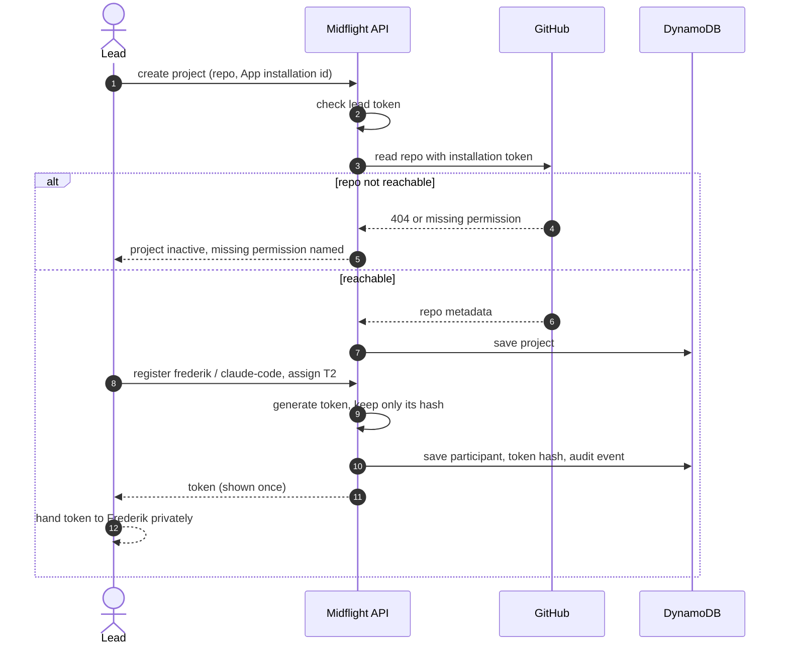
```mermaid
sequenceDiagram
    autonumber
    actor L as Lead
    participant API as Midflight API
    participant GH as GitHub
    participant DB as DynamoDB
    L->>API: create project (repo, App installation id)
    API->>API: check lead token
    API->>GH: read repo with installation token
    alt repo not reachable
        GH-->>API: 404 or missing permission
        API-->>L: project inactive, missing permission named
    else reachable
        GH-->>API: repo metadata
        API->>DB: save project
        L->>API: register frederik / claude-code, assign T2
        API->>API: generate token, keep only its hash
        API->>DB: save participant, token hash, audit event
        API-->>L: token (shown once)
        L-->>L: hand token to Frederik privately
    end
```

#### UC-03 Approve plan version

FR-02, FR-10

- **Primary actor:** Integration Lead.
- **Trigger:** The first plan, or a change such as adding `currency`.
- **Preconditions:** UC-01 is complete.
- **Includes:** UC-08 for version 2 and later.

Main success scenario:

1. The lead drafts the plan: requirements, tasks, and contracts with fields,
   provider, and consumers.
2. Midflight validates it: unique IDs, exactly one provider per contract, and
   resolvable references.
3. Midflight shows what changed from the current version: requirement and contract
   IDs added, changed, or removed.
4. The lead approves with a reason.
5. Midflight stores an immutable version, advances the project's coordination
   revision, and records an audit event.
6. For version 2 and later, Midflight runs UC-08.

Alternate and failure paths:

- **2a** Validation fails. Midflight lists each problem and saves nothing.
- **4a** Another version was approved first. The draft must be rebased on it.
- **\*a** A developer or agent attempts approval and receives 403. A proposed
  requirement never replaces the approved plan.

Postcondition: earlier versions remain readable; new claims must cite the current
version.

Sequence:

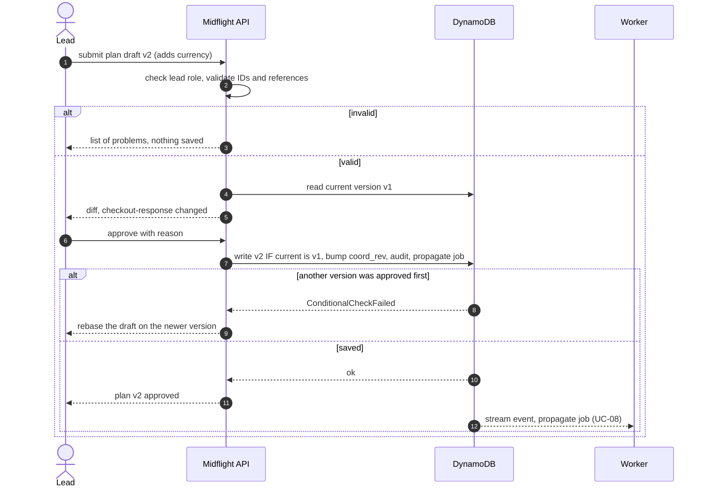
```mermaid
sequenceDiagram
    autonumber
    actor L as Lead
    participant API as Midflight API
    participant DB as DynamoDB
    participant W as Worker
    L->>API: submit plan draft v2 (adds currency)
    API->>API: check lead role, validate IDs and references
    alt invalid
        API-->>L: list of problems, nothing saved
    else valid
        API->>DB: read current version v1
        API-->>L: diff, checkout-response changed
        L->>API: approve with reason
        API->>DB: write v2 IF current is v1, bump coord_rev, audit, propagate job
        alt another version was approved first
            DB-->>API: ConditionalCheckFailed
            API-->>L: rebase the draft on the newer version
        else saved
            DB-->>API: ok
            API-->>L: plan v2 approved
            DB-->>W: stream event, propagate job (UC-08)
        end
    end
```

#### UC-13 Resolve escalation

FR-10, FR-12

- **Primary actor:** Integration Lead.
- **Trigger:** An open escalation from UC-12.
- **Preconditions:** The escalation includes evidence.

Main success scenario:

1. The lead opens the escalation. Example: T2 wants a tax-inclusive total and T1
   excludes tax.
2. Midflight shows the competing requirements, the involved claims, and evidence.
3. The lead clarifies the plan (UC-03), requests a claim revision (the claim moves
   to `needs_revision` and a directive is created), or dismisses the finding with a
   reason.
4. Midflight records who decided and why, and keeps the original finding.
5. Midflight revalidates the affected claims or commits.

Alternate and failure paths:

- **3a** The lead defers. The escalation stays open and affected approvals stay
  blocked.
- **\*a** A non-lead attempts resolution and receives 403.

Postcondition: the audit trail links each resolution to the revalidation it caused.

Sequence:

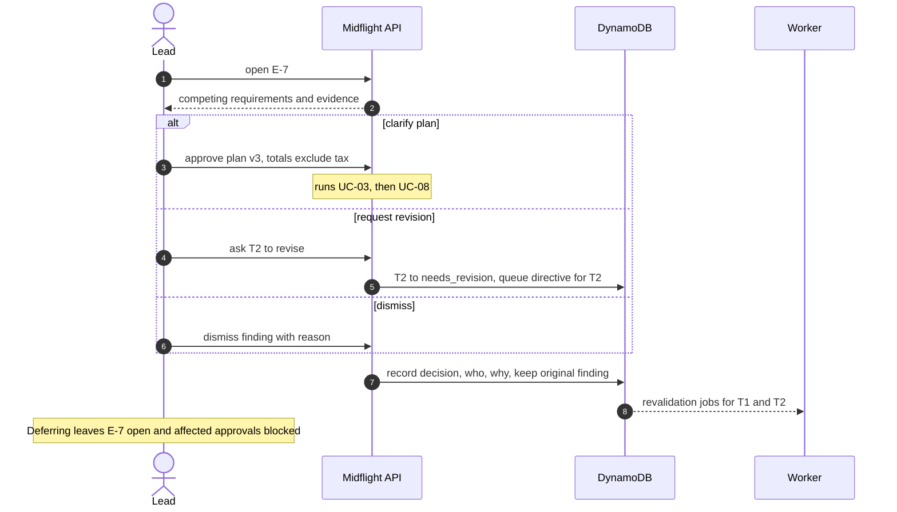
```mermaid
sequenceDiagram
    autonumber
    actor L as Lead
    participant API as Midflight API
    participant DB as DynamoDB
    participant W as Worker
    L->>API: open E-7
    API-->>L: competing requirements and evidence
    alt clarify plan
        L->>API: approve plan v3, totals exclude tax
        Note over API: runs UC-03, then UC-08
    else request revision
        L->>API: ask T2 to revise
        API->>DB: T2 to needs_revision, queue directive for T2
    else dismiss
        L->>API: dismiss finding with reason
    end
    API->>DB: record decision, who, why, keep original finding
    DB-->>W: revalidation jobs for T1 and T2
    Note over L: Deferring leaves E-7 open and affected approvals blocked
```

#### UC-14 Monitor work and audit

FR-11, FR-12, NFR-06, NFR-12

- **Primary actor:** Integration Lead.
- **Trigger:** The lead opens the dashboard.
- **Preconditions:** The lead is authenticated.

Main success scenario:

1. The dashboard shows the current plan version and each task's agent, branch,
   claim state, and open findings.
2. It lists directives with their delivery state: queued, delivered, acknowledged,
   rejected, or needs clarification.
3. It shows verification per commit (verified, failed, needs review, incomplete)
   with a GitHub link.
4. It shows sync state, last successful sync, and outstanding or failed jobs.
5. The lead opens any item's timeline to see the chain of reasons behind it.

Alternate and failure paths:

- **2a** A directive has been queued but not delivered for a long time, because
  the agent hasn't called. The lead can nudge the developer.
- **4a** A job is in the dead-letter queue. It appears with its error and a retry
  action.
- **4b** State is stale. A banner explains that GitHub may still show an old check.

Postcondition: the lead can find work that needs attention without reading raw logs.

Sequence:

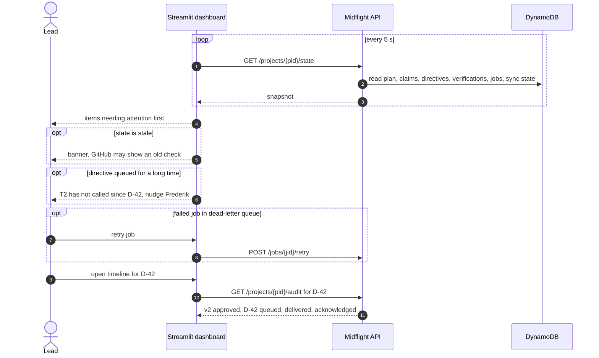
```mermaid
sequenceDiagram
    autonumber
    actor L as Lead
    participant UI as Streamlit dashboard
    participant API as Midflight API
    participant DB as DynamoDB
    loop every 5 s
        UI->>API: GET /projects/{pid}/state
        API->>DB: read plan, claims, directives, verifications, jobs, sync state
        API-->>UI: snapshot
    end
    UI-->>L: items needing attention first
    opt state is stale
        UI-->>L: banner, GitHub may show an old check
    end
    opt directive queued for a long time
        UI-->>L: T2 has not called since D-42, nudge Frederik
    end
    opt failed job in dead-letter queue
        L->>UI: retry job
        UI->>API: POST /jobs/{jid}/retry
    end
    L->>UI: open timeline for D-42
    UI->>API: GET /projects/{pid}/audit for D-42
    API-->>UI: v2 approved, D-42 queued, delivered, acknowledged
```

### Agent work

#### UC-02 Connect coding agent

FR-07

- **Primary actor:** Developer.
- **Trigger:** The developer receives a token from UC-01.
- **Preconditions:** The agent host supports MCP over stdio.

Main success scenario:

1. The developer installs the local MCP adapter.
2. The developer adds it to the agent's MCP configuration, with the API URL and
   token in environment variables.
3. The agent lists three tools: `submit_claim`, `check_in`, and
   `acknowledge_directive`. It also receives the adapter's instructions for
   planning checkpoints and reporting assumptions (D10).
4. The developer installs the git pre-push hook in their clone (UC-16).
5. Optionally, for Claude Code, the developer installs the hook that runs
   `check_in` automatically.
6. A smoke call to `check_in` returns the developer's assigned task.

Alternate and failure paths:

- **6a** The token is invalid. The adapter reports 401 and names the setting to fix.
- **6b** The API is unreachable. The adapter returns an error saying review is
  unavailable and never tells the agent to proceed.

Postcondition: the agent and its git client can reach Midflight.

Sequence:

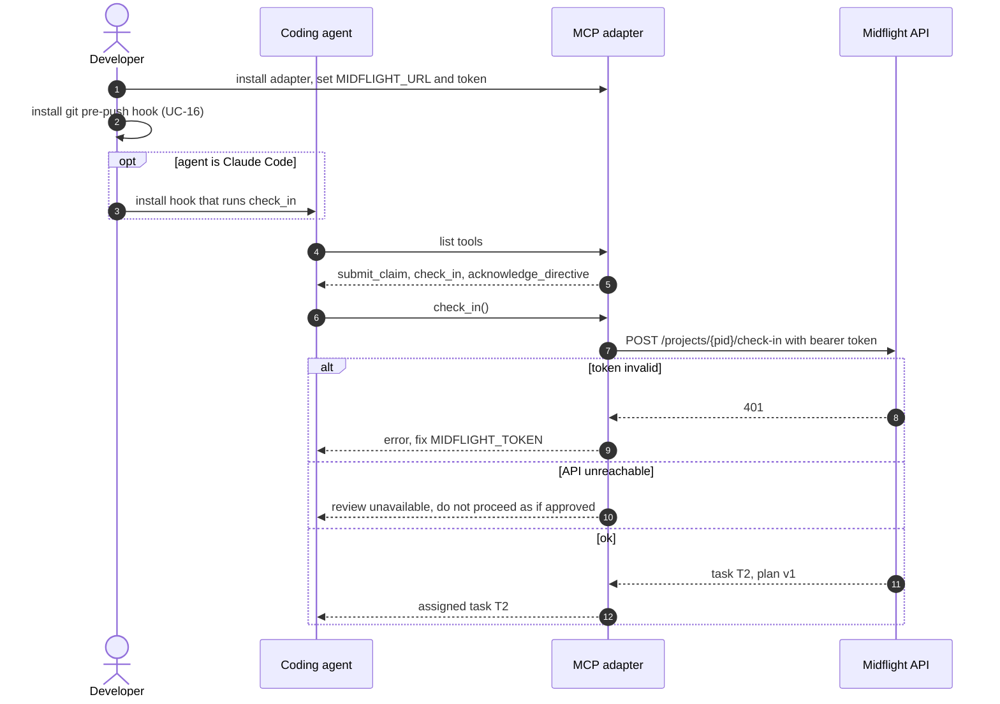
```mermaid
sequenceDiagram
    autonumber
    actor D as Developer
    participant A as Coding agent
    participant AD as MCP adapter
    participant API as Midflight API
    D->>AD: install adapter, set MIDFLIGHT_URL and token
    D->>D: install git pre-push hook (UC-16)
    opt agent is Claude Code
        D->>A: install hook that runs check_in
    end
    A->>AD: list tools
    AD-->>A: submit_claim, check_in, acknowledge_directive
    A->>AD: check_in()
    AD->>API: POST /projects/{pid}/check-in with bearer token
    alt token invalid
        API-->>AD: 401
        AD-->>A: error, fix MIDFLIGHT_TOKEN
    else API unreachable
        AD-->>A: review unavailable, do not proceed as if approved
    else ok
        API-->>AD: task T2, plan v1
        AD-->>A: assigned task T2
    end
```

#### UC-07 Check in

FR-07, FR-06

- **Primary actors:** Coding Agent, Developer.
- **Trigger:** A checkpoint the agent planned at a critical point of its task (D10:
  before implementing, before building on a contract or shared interface, when an
  assumption or its scope changes, before pushing), or a host hook acting for the
  agent.
- **Preconditions:** UC-02 is complete.

Main success scenario:

1. The agent, or its hook, calls `check_in(T2)`.
2. Midflight returns what changed since the last check-in: plan version, claim
   state, findings, and new directives.
3. Midflight marks the returned directives as delivered.
4. If there are blocking findings or unacknowledged blocking directives, the reply
   tells the agent to pause or revise.
5. Otherwise the agent continues.

Alternate and failure paths:

- **2a** Nothing changed. The reply is short: current plan version and "no changes".
- **2b** A review is still running. The reply says `pending`, and the agent keeps
  working on non-conflicting steps without resubmitting.
- **2c** State is stale. The reply flags it and withholds new directives.
- **2d** The agent asks about another person's task. It receives a read-only view of
  contracts it consumes; anything else is 403 (Q3).
- **5a** The agent has made a new assumption, or its scope has changed, since its
  last claim. It submits a revised claim with the updated assumptions (UC-06) and
  waits for the verdict before building on it.

Postcondition: the agent works from the current plan, not from its own conversation
history.

Sequence:

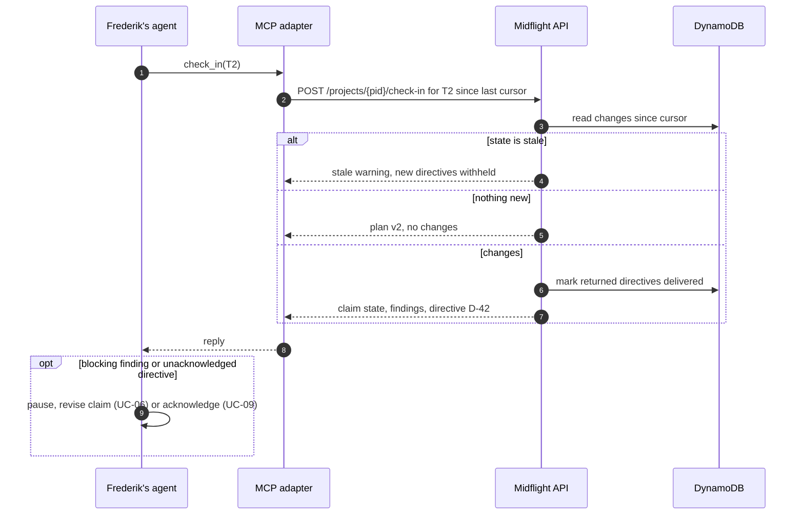
```mermaid
sequenceDiagram
    autonumber
    participant A as Frederik's agent
    participant AD as MCP adapter
    participant API as Midflight API
    participant DB as DynamoDB
    A->>AD: check_in(T2)
    AD->>API: POST /projects/{pid}/check-in for T2 since last cursor
    API->>DB: read changes since cursor
    alt state is stale
        API-->>AD: stale warning, new directives withheld
    else nothing new
        API-->>AD: plan v2, no changes
    else changes
        API->>DB: mark returned directives delivered
        API-->>AD: claim state, findings, directive D-42
    end
    AD-->>A: reply
    opt blocking finding or unacknowledged directive
        A->>A: pause, revise claim (UC-06) or acknowledge (UC-09)
    end
```

#### UC-04 Submit claim

FR-03, FR-04, NFR-01

- **Primary actor:** Coding Agent.
- **Trigger:** The agent is about to start implementing a task.
- **Preconditions:** An approved plan exists, and the task is assigned to this agent.
- **Includes:** UC-05.

Main success scenario:

1. The agent calls `submit_claim` with task, branch, base SHA, plan version,
   requirement IDs, expected files, provided and consumed contracts with field
   types, assumptions, and acceptance criteria.
2. Midflight authenticates the caller and validates every reference.
3. Midflight saves a `pending` claim and its review job in one write.
4. Midflight runs UC-05 in the background while the adapter waits.
5. The adapter returns the verdict in the same call: `approved`, `needs_revision`,
   or `human_review_required`, with the agreed contracts, findings, proposed
   corrections, and any pending directives.
6. If approved, the agent builds against the returned contract. Otherwise it
   revises through UC-06.

Alternate and failure paths:

- **2a** An unknown requirement or contract ID. The error lists valid IDs and
  nothing is saved.
- **2b** An outdated plan version. The error identifies the current version.
- **2c** The task belongs to another agent. 403.
- **2d** The claim omits interfaces or criteria. It is saved as a draft, and the
  verdict asks for the missing detail before approval (D5). A task with no
  interfaces, like T3, declares `no_interfaces: true` instead (D12).
- **5a** The review exceeds the wait limit. The call returns `pending` with a job
  ID, and the verdict arrives in the agent's next `check_in`.

Postcondition: no accepted claim ever lacks a review job.

Sequence:

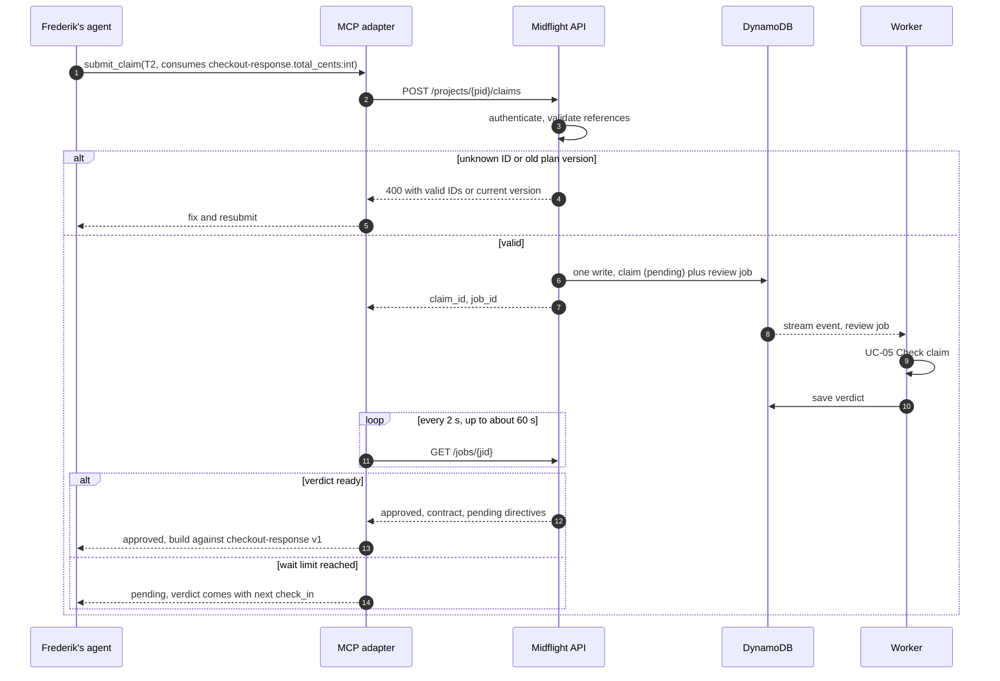
```mermaid
sequenceDiagram
    autonumber
    participant A as Frederik's agent
    participant AD as MCP adapter
    participant API as Midflight API
    participant DB as DynamoDB
    participant W as Worker
    A->>AD: submit_claim(T2, consumes checkout-response.total_cents:int)
    AD->>API: POST /projects/{pid}/claims
    API->>API: authenticate, validate references
    alt unknown ID or old plan version
        API-->>AD: 400 with valid IDs or current version
        AD-->>A: fix and resubmit
    else valid
        API->>DB: one write, claim (pending) plus review job
        API-->>AD: claim_id, job_id
        DB-->>W: stream event, review job
        W->>W: UC-05 Check claim
        W->>DB: save verdict
        loop every 2 s, up to about 60 s
            AD->>API: GET /jobs/{jid}
        end
        alt verdict ready
            API-->>AD: approved, contract, pending directives
            AD-->>A: approved, build against checkout-response v1
        else wait limit reached
            AD-->>A: pending, verdict comes with next check_in
        end
    end
```

#### UC-05 Check claim

FR-04, NFR-02, NFR-03, NFR-05

- **Kind:** Included by UC-04 and UC-06. **Supporting:** AI Reviewer.
- **Trigger:** A review job. **Extended by:** UC-12.

Main success scenario:

1. The worker loads the approved plan and active claims at coordination revision
   *N*.
2. Deterministic rules run first: stale version, missing references, contract field
   or type mismatch (`total` versus `total_cents`), and file overlap (recorded as
   information only).
3. The worker sends free-text assumptions and related claims to the AI Reviewer.
4. It validates the reply against the findings schema and confirms that every cited
   ID exists.
5. It decides `approved` or `needs_revision`, with evidence and a proposed
   correction. An approval includes the contracts the agent must follow.
6. It saves the decision only if the coordination revision is still *N*, and
   records an audit event.

Alternate and failure paths:

- **4a** The reply is malformed or times out. No approval is possible. The job
  retries a bounded number of times, then reports "review incomplete".
- **5a** A requirement conflict or uncertain finding goes to UC-12.
- **6a** Another claim changed the revision. The review reruns from step 1, a
  bounded number of times.
- **\*a** The same job is delivered twice. One decision and one audit event result.

Postcondition: two conflicting claims can never both be approved from an outdated
snapshot.

Sequence:

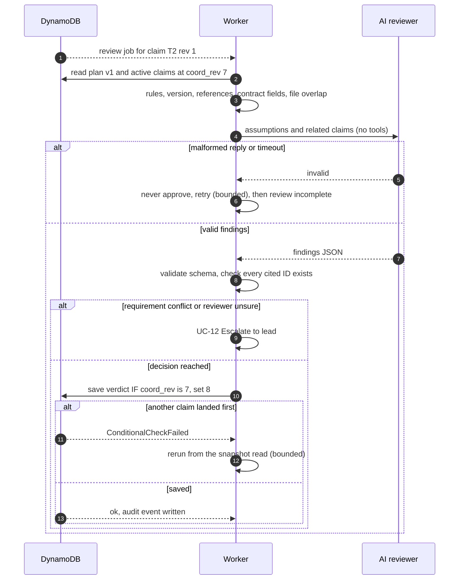
```mermaid
sequenceDiagram
    autonumber
    participant DB as DynamoDB
    participant W as Worker
    participant R as AI reviewer
    DB-->>W: review job for claim T2 rev 1
    W->>DB: read plan v1 and active claims at coord_rev 7
    W->>W: rules, version, references, contract fields, file overlap
    W->>R: assumptions and related claims (no tools)
    alt malformed reply or timeout
        R-->>W: invalid
        W->>W: never approve, retry (bounded), then review incomplete
    else valid findings
        R-->>W: findings JSON
        W->>W: validate schema, check every cited ID exists
        alt requirement conflict or reviewer unsure
            W->>W: UC-12 Escalate to lead
        else decision reached
            W->>DB: save verdict IF coord_rev is 7, set 8
            alt another claim landed first
                DB-->>W: ConditionalCheckFailed
                W->>W: rerun from the snapshot read (bounded)
            else saved
                DB-->>W: ok, audit event written
            end
        end
    end
```

#### UC-06 Revise or withdraw claim

FR-03

- **Primary actor:** Coding Agent.
- **Trigger:** A finding, a directive, or new information.
- **Preconditions:** The claim exists and belongs to this agent.
- **Includes:** UC-05 for revisions.

Main success scenario:

1. The agent submits a revision with the same claim ID, for example T2 now consuming
   `total_cents: integer`.
2. Midflight keeps the previous revision and its findings, and stores the new one as
   `pending`.
3. Midflight runs UC-05 and returns the verdict in the same call, as in UC-04.

Alternate and failure paths:

- **1a** The agent withdraws the claim, or closes an approved claim when the work is
  done (D11). It stops reserving work and is excluded from other claims' checks.
- **1b** A different agent attempts the revision. 403.

Postcondition: the claim history shows every revision and its reason.

Sequence:

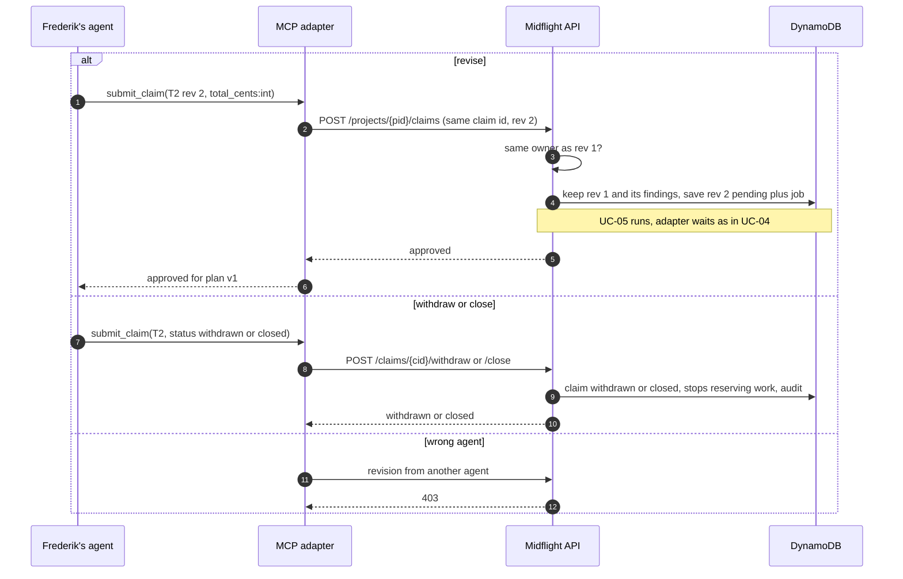
```mermaid
sequenceDiagram
    autonumber
    participant A as Frederik's agent
    participant AD as MCP adapter
    participant API as Midflight API
    participant DB as DynamoDB
    alt revise
        A->>AD: submit_claim(T2 rev 2, total_cents:int)
        AD->>API: POST /projects/{pid}/claims (same claim id, rev 2)
        API->>API: same owner as rev 1?
        API->>DB: keep rev 1 and its findings, save rev 2 pending plus job
        Note over API,DB: UC-05 runs, adapter waits as in UC-04
        API-->>AD: approved
        AD-->>A: approved for plan v1
    else withdraw or close
        A->>AD: submit_claim(T2, status withdrawn or closed)
        AD->>API: POST /claims/{cid}/withdraw or /close
        API->>DB: claim withdrawn or closed, stops reserving work, audit
        API-->>AD: withdrawn or closed
    else wrong agent
        AD->>API: revision from another agent
        API-->>AD: 403
    end
```

#### UC-09 Acknowledge directive

FR-06, FR-07

- **Primary actor:** Coding Agent.
- **Trigger:** A directive arrives in any Midflight reply: `submit_claim`,
  `check_in`, or a hook-initiated `check_in`.
- **Preconditions:** A current, non-superseded directive exists for the task.

Main success scenario:

1. The agent reads D-42: "display `currency` next to the total (plan v2)".
2. The agent treats it as information to consider, never as a command to execute.
3. The agent calls `acknowledge_directive(D-42, acknowledged, note)`.
4. The lead sees the acknowledgment on the dashboard.
5. The agent revises its claim through UC-06.

Alternate and failure paths:

- **3a** The agent replies `needs_clarification`. The question appears for the lead.
- **3b** The agent replies `rejected` with a reason. The lead is alerted.
- **1a** The directive was superseded by plan v3. Only the replacement is delivered.

Postcondition: acknowledged means received, not implemented. Only UC-10 establishes
implementation.

Sequence:

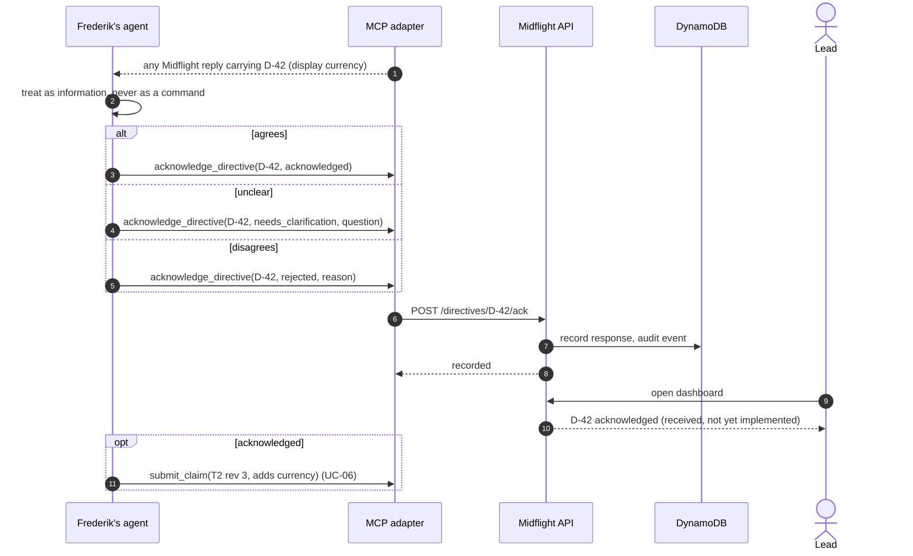
```mermaid
sequenceDiagram
    autonumber
    participant A as Frederik's agent
    participant AD as MCP adapter
    participant API as Midflight API
    participant DB as DynamoDB
    actor L as Lead
    AD-->>A: any Midflight reply carrying D-42 (display currency)
    A->>A: treat as information, never as a command
    alt agrees
        A->>AD: acknowledge_directive(D-42, acknowledged)
    else unclear
        A->>AD: acknowledge_directive(D-42, needs_clarification, question)
    else disagrees
        A->>AD: acknowledge_directive(D-42, rejected, reason)
    end
    AD->>API: POST /directives/D-42/ack
    API->>DB: record response, audit event
    API-->>AD: recorded
    L->>API: open dashboard
    API-->>L: D-42 acknowledged (received, not yet implemented)
    opt acknowledged
        A->>AD: submit_claim(T2 rev 3, adds currency) (UC-06)
    end
```

#### UC-16 Gate push on directives

FR-07

- **Primary actor:** Coding Agent (through `git push`).
- **Trigger:** A push from a clone with the Midflight pre-push hook installed.
- **Preconditions:** UC-02 step 4 is complete.

Main success scenario:

1. The agent runs `git push`.
2. The pre-push hook calls `check_in` for the branch's task.
3. The claim is approved for the current plan version, and no blocking directive is
   unacknowledged.
4. The push proceeds.

Alternate and failure paths:

- **3a** A blocking directive is unacknowledged. The push is refused, and the hook
  prints the directive. The agent now has it in context.
- **3b** The claim is not approved for the current plan version. The push is refused
  with the reason.
- **2a** Midflight is unreachable. The hook warns and allows the push, because UC-10
  still verifies the commit on GitHub (D8).

Postcondition: no agent can push without having seen the current directives. This
is a local convenience, not a security control; `--no-verify` bypasses it, and the
required GitHub check remains the enforcement point.

Sequence:

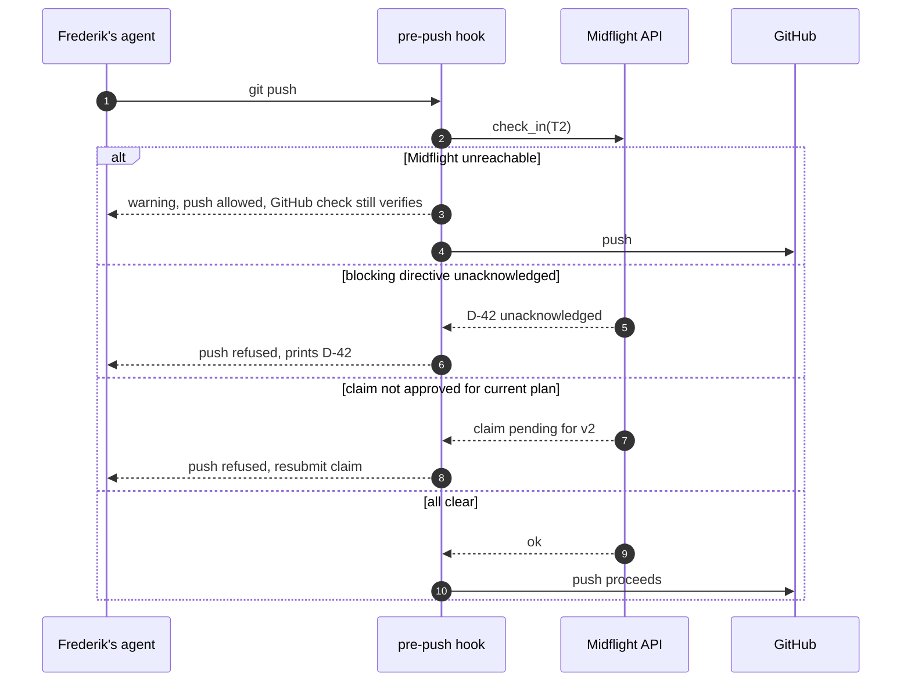
```mermaid
sequenceDiagram
    autonumber
    participant A as Frederik's agent
    participant PP as pre-push hook
    participant API as Midflight API
    participant GH as GitHub
    A->>PP: git push
    PP->>API: check_in(T2)
    alt Midflight unreachable
        PP-->>A: warning, push allowed, GitHub check still verifies
        PP->>GH: push
    else blocking directive unacknowledged
        API-->>PP: D-42 unacknowledged
        PP-->>A: push refused, prints D-42
    else claim not approved for current plan
        API-->>PP: claim pending for v2
        PP-->>A: push refused, resubmit claim
    else all clear
        API-->>PP: ok
        PP->>GH: push proceeds
    end
```

#### UC-08 Propagate plan change

FR-05, FR-06, NFR-02

- **Kind:** Included by UC-03. **Trigger:** Plan version *N* > 1 is approved.
- **Extended by:** UC-12 (unclear impact), UC-15 (stale state).

Main success scenario:

1. Midflight compares versions *N*−1 and *N* and finds that `checkout-response`
   changed.
2. It looks up the contract's provider (T1), consumers (T2), and any task
   implementing a changed requirement.
3. Each affected active approval returns to `pending` for revalidation.
4. Midflight creates one directive per affected task, with reason, changed IDs, and
   requested adjustment, in state `queued`.
5. It supersedes the task's older directives that are still `queued` or `delivered`.
6. T3 has no link to the change and receives nothing.
7. Each directive is delivered in its recipient's next Midflight reply (UC-07,
   UC-04, or UC-16). Midflight cannot interrupt a running agent.

Alternate and failure paths:

- **2a** Impact is unclear, such as a requirement text change without a contract
  link. Midflight escalates through UC-12 instead of guessing.
- **4a** State is stale. Directives are held until data is fresh (UC-15).
- **\*a** The event is processed twice. One directive exists per (plan version,
  task) pair.

Postcondition: no affected task keeps an approval based on the old version.

Sequence:

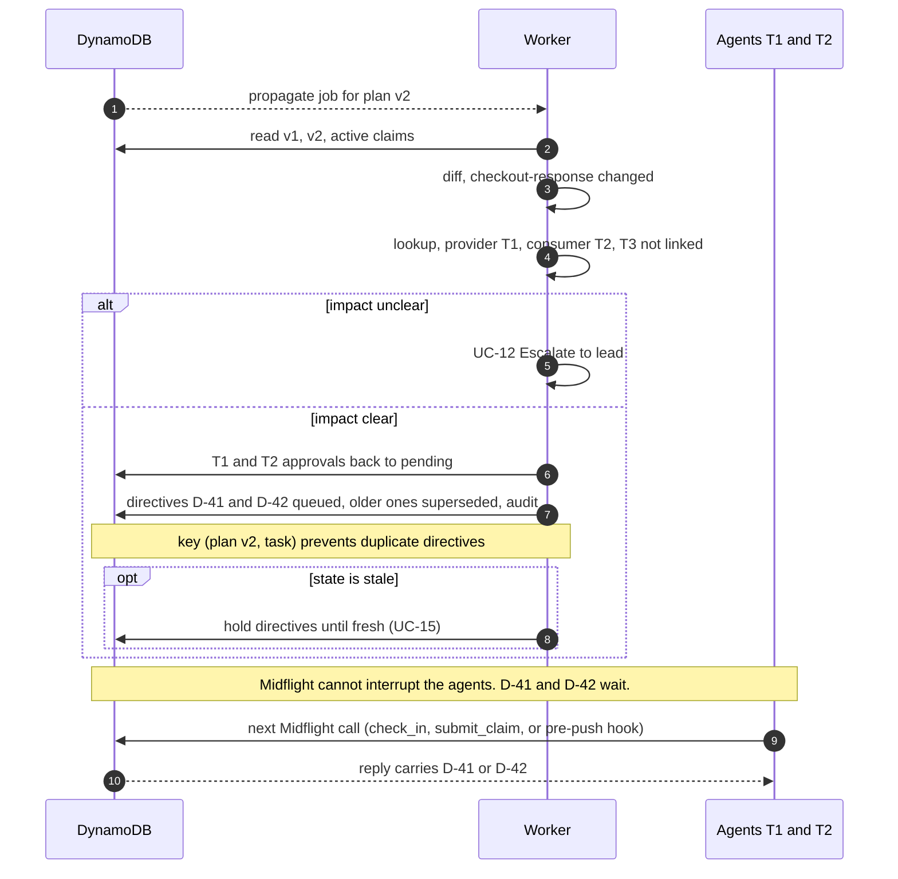
```mermaid
sequenceDiagram
    autonumber
    participant DB as DynamoDB
    participant W as Worker
    participant A as Agents T1 and T2
    DB-->>W: propagate job for plan v2
    W->>DB: read v1, v2, active claims
    W->>W: diff, checkout-response changed
    W->>W: lookup, provider T1, consumer T2, T3 not linked
    alt impact unclear
        W->>W: UC-12 Escalate to lead
    else impact clear
        W->>DB: T1 and T2 approvals back to pending
        W->>DB: directives D-41 and D-42 queued, older ones superseded, audit
        Note over W,DB: key (plan v2, task) prevents duplicate directives
        opt state is stale
            W->>DB: hold directives until fresh (UC-15)
        end
    end
    Note over DB,A: Midflight cannot interrupt the agents. D-41 and D-42 wait.
    A->>DB: next Midflight call (check_in, submit_claim, or pre-push hook)
    DB-->>A: reply carries D-41 or D-42
```

#### UC-12 Escalate to lead

FR-04, FR-05, FR-09, FR-10

- **Kind:** Extends UC-05, UC-08, and UC-10.
- **Extension points:** conflicting human requirements, an uncertain finding,
  unclear change impact, or a branch editing its own contract tests.

Main success scenario:

1. Midflight creates an escalation with the competing requirements, the involved
   claims or commit, and the evidence.
2. Affected claims move to `human_review_required`, or the commit check to
   `action_required`.
3. Affected approvals and passes stay blocked while the escalation is open.
4. The escalation appears on the lead's dashboard for UC-13.

Rule: Midflight never chooses between two people's requirements (FR-10).

Postcondition: nothing that depends on an open question can show as passing.

Sequence:

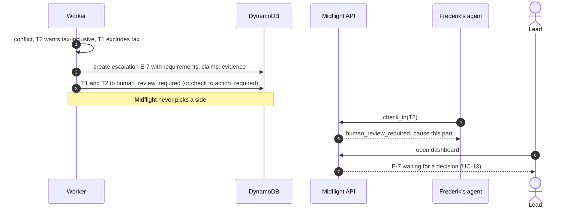
```mermaid
sequenceDiagram
    autonumber
    participant W as Worker
    participant DB as DynamoDB
    participant API as Midflight API
    participant A as Frederik's agent
    actor L as Lead
    W->>W: conflict, T2 wants tax-inclusive, T1 excludes tax
    W->>DB: create escalation E-7 with requirements, claims, evidence
    W->>DB: T1 and T2 to human_review_required (or check to action_required)
    Note over W,DB: Midflight never picks a side
    A->>API: check_in(T2)
    API-->>A: human_review_required, pause this part
    L->>API: open dashboard
    API-->>L: E-7 waiting for a decision (UC-13)
```

### Verify

#### UC-10 Verify pushed commit

FR-08, FR-09, NFR-08, NFR-10

- **Primary actor:** GitHub (signed webhook). **Supporting:** AI Reviewer.
- **Trigger:** The contract-test workflow (`contract.yml`) finishes for a pull
  request's head commit: `workflow_run` with action `completed` (D4).
- **Preconditions:** The pull request's branch is linked to a claim.
- **Includes:** UC-11. **Extended by:** UC-12, UC-15.

Main success scenario:

1. Midflight validates the webhook signature, drops duplicate delivery IDs, saves a
   job, and responds 202.
2. The worker fetches the current pull request head and confirms it matches the
   event's SHA.
3. It fetches the diff, relevant file content, and contract-test results for that
   exact SHA.
4. Deterministic rules run: undeclared files, required contract fields, and test
   results. Edits to contract tests or workflows go to UC-12.
5. The AI Reviewer adds semantic findings, validated as in UC-05.
6. Before publishing, the worker confirms the head SHA and plan version are
   unchanged.
7. Midflight runs UC-11.

Alternate and failure paths:

- **1a** The signature is invalid. 401, and nothing is stored.
- **2a** GitHub errors or rate-limits. UC-15 runs.
- **3a** The diff is truncated or test results are missing. The result is
  incomplete, never success.
- **4a** The agent reported completion, but `total_cents` is missing. The result is
  failure with evidence, and a correction directive is queued for the agent.
- **5a** The diff contains instructions aimed at the AI. They are treated as data and
  may be noted, but cannot change the outcome.
- **6a** A newer commit or plan arrived. The result is discarded and a new job runs.

Postcondition: the result is tied to one commit, one claim revision, and one plan
version.

Sequence:

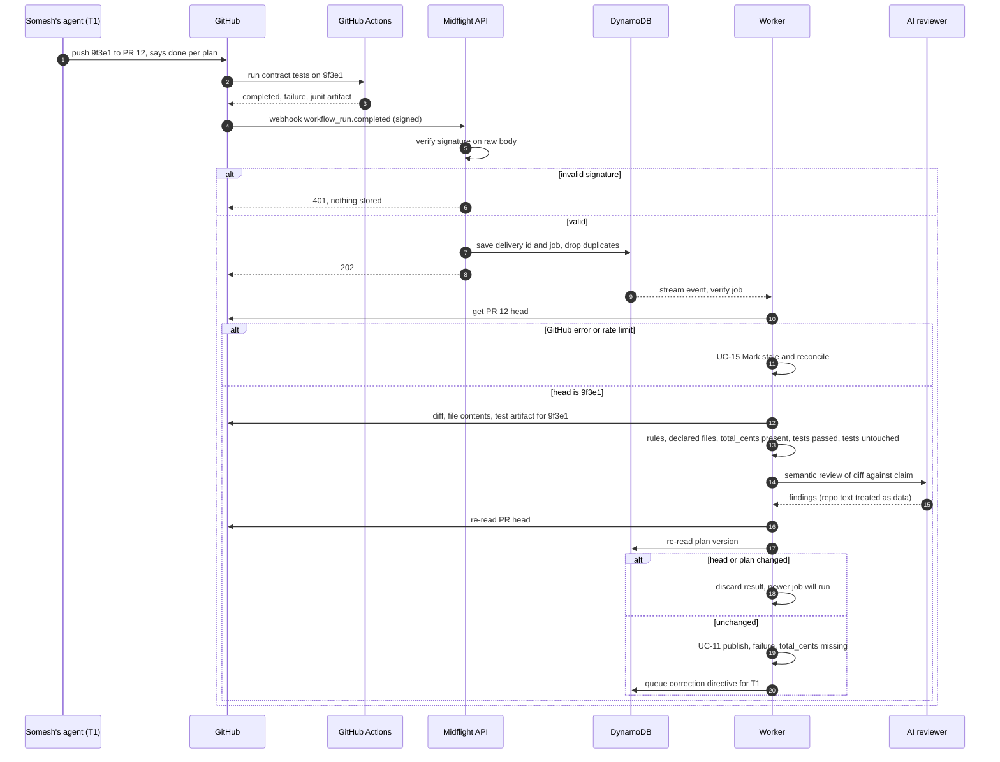
```mermaid
sequenceDiagram
    autonumber
    participant A as Somesh's agent (T1)
    participant GH as GitHub
    participant CI as GitHub Actions
    participant API as Midflight API
    participant DB as DynamoDB
    participant W as Worker
    participant R as AI reviewer
    A->>GH: push 9f3e1 to PR 12, says done per plan
    GH->>CI: run contract tests on 9f3e1
    CI-->>GH: completed, failure, junit artifact
    GH->>API: webhook workflow_run.completed (signed)
    API->>API: verify signature on raw body
    alt invalid signature
        API-->>GH: 401, nothing stored
    else valid
        API->>DB: save delivery id and job, drop duplicates
        API-->>GH: 202
        DB-->>W: stream event, verify job
        W->>GH: get PR 12 head
        alt GitHub error or rate limit
            W->>W: UC-15 Mark stale and reconcile
        else head is 9f3e1
            W->>GH: diff, file contents, test artifact for 9f3e1
            W->>W: rules, declared files, total_cents present, tests passed, tests untouched
            W->>R: semantic review of diff against claim
            R-->>W: findings (repo text treated as data)
            W->>GH: re-read PR head
            W->>DB: re-read plan version
            alt head or plan changed
                W->>W: discard result, newer job will run
            else unchanged
                W->>W: UC-11 publish, failure, total_cents missing
                W->>DB: queue correction directive for T1
            end
        end
    end
```

#### UC-11 Publish verify check

FR-09

- **Kind:** Included by UC-10. **Supporting:** GitHub.
- **Preconditions:** Repository rules require `midflight/verify` before merge.

Main success scenario:

1. Midflight maps the outcome to a check conclusion: verified to success, failed to
   failure, and needs review or incomplete to action required.
2. It writes a summary with findings, evidence links, plan version, and claim
   revision.
3. It stores the check run ID with the verification record.

Alternate and failure paths:

- **1a** Publishing fails. The record is marked unpublished, retried, and shown on
  the dashboard.

Postcondition: merge is blocked unless the current commit's check is success.

Sequence:

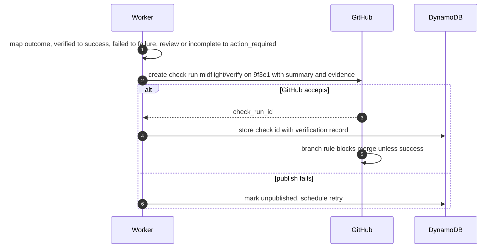
```mermaid
sequenceDiagram
    autonumber
    participant W as Worker
    participant GH as GitHub
    participant DB as DynamoDB
    W->>W: map outcome, verified to success, failed to failure, review or incomplete to action_required
    W->>GH: create check run midflight/verify on 9f3e1 with summary and evidence
    alt GitHub accepts
        GH-->>W: check_run_id
        W->>DB: store check id with verification record
        GH->>GH: branch rule blocks merge unless success
    else publish fails
        W->>DB: mark unpublished, schedule retry
    end
```

#### UC-15 Mark stale and reconcile

FR-08, NFR-04, NFR-06

- **Kind:** Extends UC-10 and UC-08.
- **Extension point:** GitHub 5xx, rate limit, or timeout.

Main success scenario:

1. Midflight marks the project's sync state `stale` with a timestamp.
2. It holds directives and approvals that depend on GitHub data.
3. It retries after the rate-limit reset time, a bounded number of times.
4. After recovery, it refetches pull request heads, reruns affected verifications,
   and republishes checks.
5. It clears the stale flag and records an audit event.

Alternate and failure paths:

- **3a** Retries are exhausted. The job moves to the dead-letter queue and appears on
  the dashboard (UC-14).

Limitation: during an outage, GitHub may still show an earlier successful check. The
dashboard states this.

Sequence:

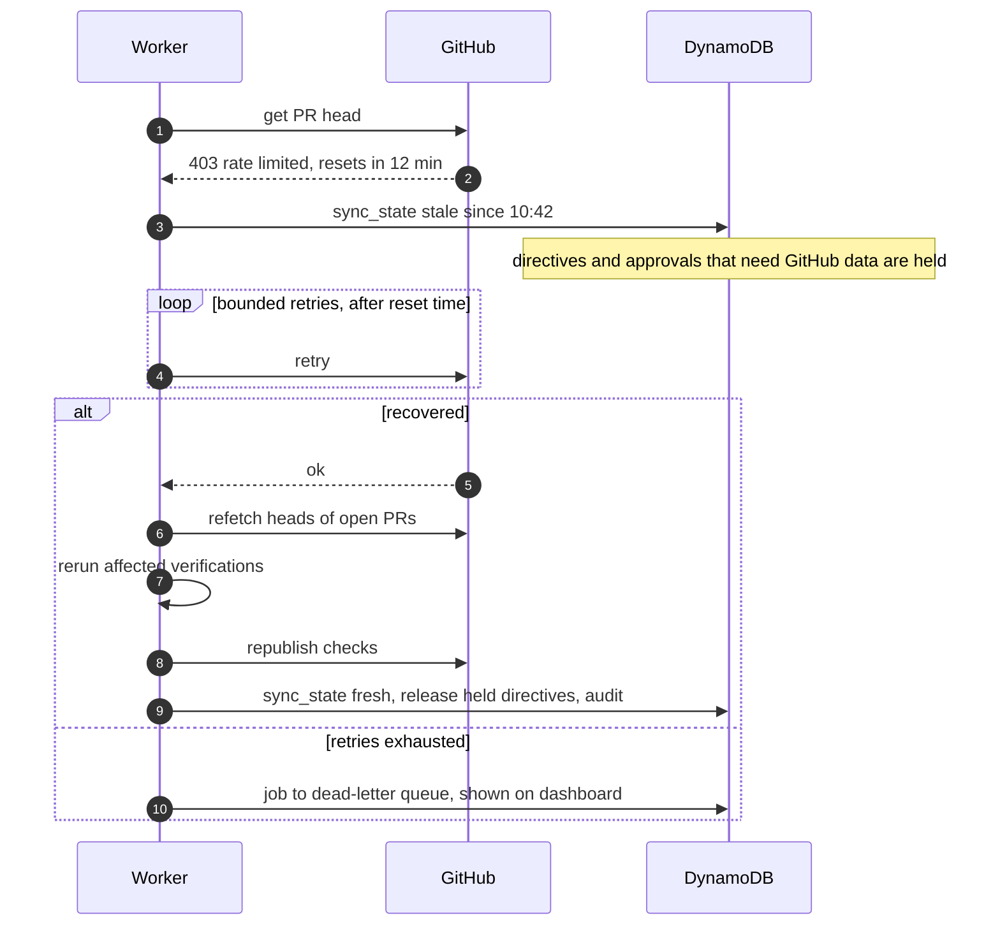
```mermaid
sequenceDiagram
    autonumber
    participant W as Worker
    participant GH as GitHub
    participant DB as DynamoDB
    W->>GH: get PR head
    GH-->>W: 403 rate limited, resets in 12 min
    W->>DB: sync_state stale since 10:42
    Note over DB: directives and approvals that need GitHub data are held
    loop bounded retries, after reset time
        W->>GH: retry
    end
    alt recovered
        GH-->>W: ok
        W->>GH: refetch heads of open PRs
        W->>W: rerun affected verifications
        W->>GH: republish checks
        W->>DB: sync_state fresh, release held directives, audit
    else retries exhausted
        W->>DB: job to dead-letter queue, shown on dashboard
    end
```

## Demo traceability

Every scenario in [requirements §11](requirements.md#11-required-demonstration-and-evaluation)
and the definition of done maps to a use case.

| Demo scenario | Expected result | Use case and path |
| --- | --- | --- |
| Compatible backend and frontend claims | Both approved | UC-04, UC-05 main |
| Frontend expects `total`; backend provides `total_cents` | Caught before coding, then corrected | UC-04 step 5, UC-05 step 2, UC-06 |
| Two tasks touch the same file | Visible, not blocked | UC-05 step 2 |
| Simultaneous conflicting claims | No approval from an outdated snapshot | UC-05 6a |
| Two people's requirements conflict | Escalated, resolved, audited | UC-12, UC-13 |
| Lead adds required `currency` | Provider and consumer receive directives | UC-03, UC-08, UC-07, UC-09 |
| Unrelated documentation task | No directive | UC-08 step 6 |
| Agent mid-work when plan changes | Directive arrives at next call or hook; push blocked until acknowledged | UC-08 step 7, UC-07, UC-16 3a |
| Agent reports done but pushes the wrong field | Check fails with evidence | UC-10 4a, UC-11 |
| GitHub failure or rate limit | Stale state; directives held | UC-15, UC-08 4a |
| Duplicate webhook | One logical outcome | UC-10 step 1 |
| New commit or plan during review | Obsolete result cannot pass | UC-10 6a |
| Instruction-like text in repository content | Treated as data | UC-10 5a |
| Correction and recovery | Fresh pass; audit explains the transition | UC-06, UC-10, UC-14 |

## Review questions

Answered or tracked in [design-decisions.md](design-decisions.md):

| # | Question | Where it stands |
| --- | --- | --- |
| 1 | Adopt `submit_claim`, `check_in`, `acknowledge_directive`? | D3 (default). FR-07 updated. |
| 2 | Can developers submit claims directly? | Open, Q1. Default: agents only. |
| 3 | Incomplete claims (UC-04 2d)? | D5: saved as `draft`, no approval until complete. |
| 4 | Can agents accept a proposed contract without the lead? | Open, Q2. Default: no, contract changes go through the lead. |
| 5 | Verification trigger (UC-10)? | D4: when the contract-test workflow completes. |
| 6 | Cross-task visibility (UC-07 2d)? | Open, Q3. Default: read-only view. |
| 7 | Pre-push hook when Midflight is down (UC-16 2a)? | D8: warn and allow. |
| 8 | Canonical plan change? | D2: `currency`. |
