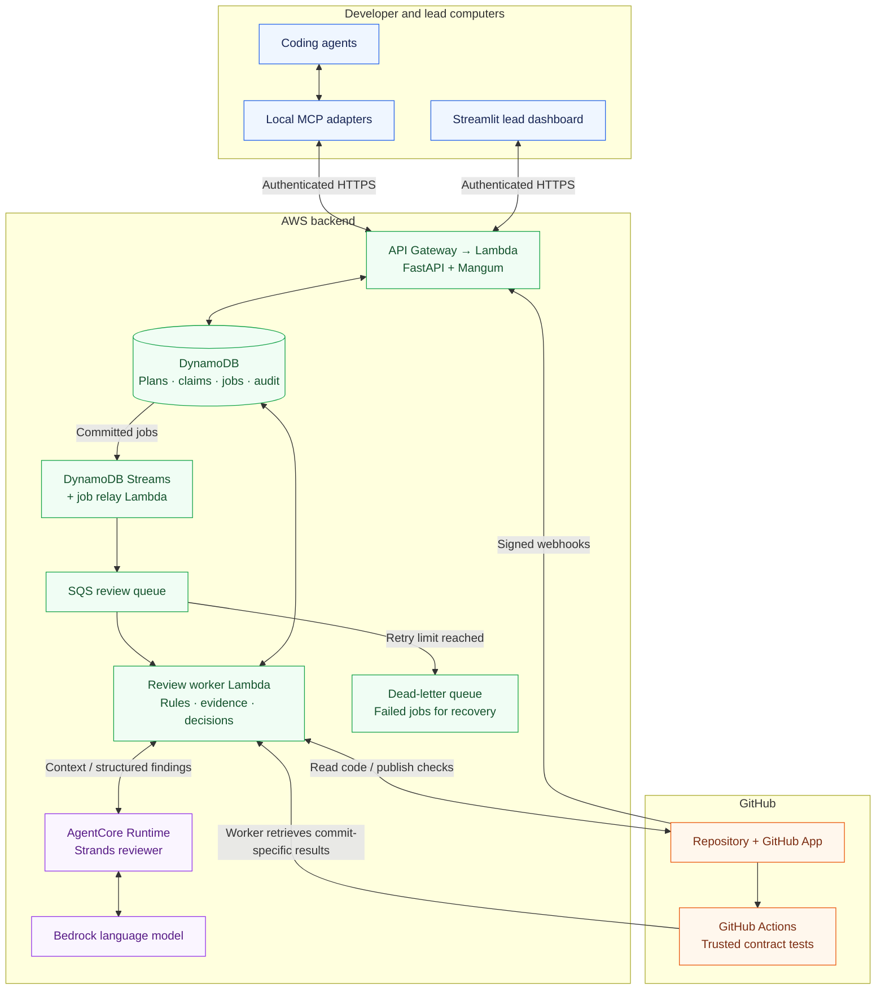
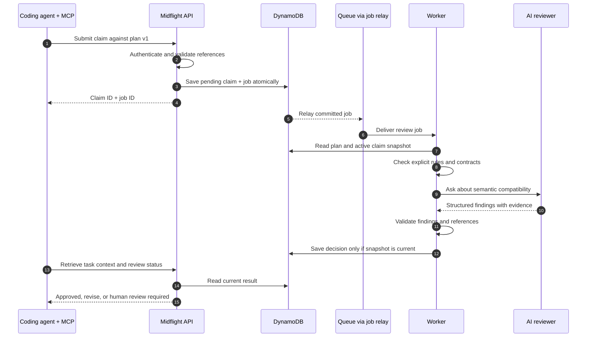
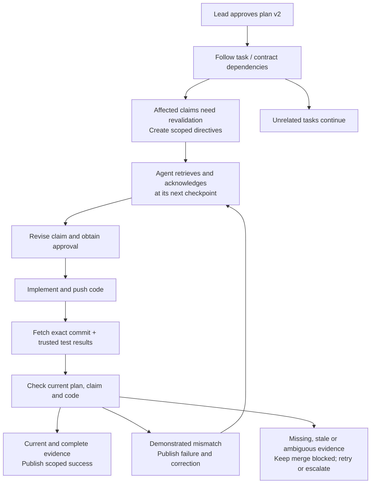

# Midflight system architecture

Proposed AWS hackathon architecture · October 6, 2026

Midflight coordinates a small team's coding agents: it checks intended work against a shared plan, distributes approved requirement changes, and verifies pushed code. Start with one Python codebase, separate API and worker entry points, and one AI reviewer. This design supports one GitHub repository and 2–4 developers.

**1. Where everything runs**

**Reading the diagram:** clients submit requests to the API; durable jobs reach the queue; workers gather evidence and ask the reviewer for findings. Workers validate those findings before updating state or GitHub. The dashboard and agents retrieve results through the API. Secrets, permissions, and monitoring support all backend components and are described below.

**2. Technologies and their roles**

| Technology | What it is and how Midflight uses it | Read more |
| --- | --- | --- |
| **Python + uv** | Python is the implementation language, extending the existing prototype. uv manages dependencies and a lockfile so teammates install compatible packages. | [Python tutorial](https://docs.python.org/3/tutorial/) · [uv](https://docs.astral.sh/uv/) |
| **Pydantic** | Defines and validates structured data: claims, plan versions, directives, and model findings. Application rules additionally check permissions, referenced IDs, and evidence. | [Models and validation](https://docs.pydantic.dev/latest/concepts/models/) |
| **FastAPI** | The backend web framework. Provides endpoints for submitting claims, reading review status, approving plans, and acknowledging directives, plus interactive API documentation. | [Tutorial](https://fastapi.tiangolo.com/tutorial/) |
| **API Gateway + Lambda + Mangum** | API Gateway is the public HTTPS entrance. Lambda executes request handlers without a permanently running server; Mangum adapts FastAPI to Lambda events. Slow reviews go to workers. | [HTTP APIs](https://docs.aws.amazon.com/apigateway/latest/developerguide/http-api.html) · [Lambda](https://docs.aws.amazon.com/lambda/latest/dg/welcome.html) · [Mangum](https://mangum.fastapiexpert.com/) |
| **MCP Python SDK** | MCP is the tool interface used by participating coding agents. A local adapter exposes `submit_claim`, `get_task_context`, `get_directives`, and `acknowledge_directive`, then forwards requests to the API. | [Build an MCP server](https://modelcontextprotocol.io/docs/develop/build-server) |
| **DynamoDB + Boto3** | DynamoDB stores authoritative, versioned state. Conditional writes and transactions protect concurrent decisions. Boto3 is the Python SDK used to call AWS services. | [DynamoDB transactions](https://docs.aws.amazon.com/amazondynamodb/latest/developerguide/transaction-apis.html) · [Boto3](https://boto3.amazonaws.com/v1/documentation/api/latest/index.html) |
| **DynamoDB Streams + relay Lambda** | Streams exposes committed database changes. A relay forwards pending jobs to SQS; recoverable job records allow reconciliation if delivery fails. Save the claim and job together to avoid losing accepted work. | [Transactional outbox pattern](https://docs.aws.amazon.com/prescriptive-guidance/latest/cloud-design-patterns/transactional-outbox.html) |
| **SQS + worker Lambda** | SQS buffers background jobs. Workers process them with bounded timeouts and retries; a dead-letter queue retains exhausted failures. Processing can repeat, so writes must be safe to retry. | [Lambda with SQS](https://docs.aws.amazon.com/lambda/latest/dg/with-sqs.html) |
| **Strands Agents SDK** | The framework around the reviewer: prompts, model calls, optional bounded tools, and structured outputs. It helps detect semantic incompatibility, such as dollars versus cents across connected claims. | [Strands documentation](https://strandsagents.com/docs/) |
| **Amazon Bedrock** | Provides access to the language model used by Strands. Select a model available in the team's account/region after comparing conflict detection, latency, and cost on demo examples. | [Supported models](https://docs.aws.amazon.com/bedrock/latest/userguide/models-supported.html) |
| **AgentCore Runtime** | Hosts the Strands reviewer in AWS. The worker sends bounded review requests and receives findings; durable application state remains in DynamoDB. | [Runtime overview](https://docs.aws.amazon.com/bedrock-agentcore/latest/devguide/agents-tools-runtime.html) |
| **GitHub App + HTTPX** | The App gives Midflight repository permissions: read contents and pull requests, receive events, and write checks. HTTPX makes the backend's GitHub HTTP requests. | [GitHub Apps](https://docs.github.com/en/apps/creating-github-apps/about-creating-github-apps/about-creating-github-apps) · [HTTPX](https://www.python-httpx.org/) |
| **pytest + GitHub Actions** | pytest tests Midflight's rules and the demo's interface behavior. Actions executes trusted contract tests against the reviewed commit in isolated CI; the worker retrieves their results. | [pytest](https://docs.pytest.org/en/stable/) · [Actions security](https://docs.github.com/en/actions/reference/security/secure-use) |
| **Streamlit** | A Python dashboard for the lead: plans, claims, conflicts, resolutions, directives, and verification status. Run its server on the lead's laptop for the first demo. | [Streamlit architecture](https://docs.streamlit.io/develop/concepts/architecture/architecture) |
| **AWS SAM** | Describes supporting infrastructure as code and deploys the API, queues, database, and Lambdas reproducibly. Deploy the reviewer using AgentCore tooling. | [SAM introduction](https://docs.aws.amazon.com/serverless-application-model/latest/developerguide/what-is-sam.html) |
| **IAM · Secrets Manager · CloudWatch** | IAM limits each service's AWS permissions. Secrets Manager stores GitHub credentials and webhook secrets. CloudWatch records failures, latency, and usage to help debug and control costs. | [IAM](https://docs.aws.amazon.com/IAM/latest/UserGuide/introduction.html) · [Secrets](https://docs.aws.amazon.com/secretsmanager/latest/userguide/intro.html) · [Monitoring](https://docs.aws.amazon.com/AmazonCloudWatch/latest/monitoring/WhatIsCloudWatch.html) |

**Remember:** Bedrock supplies the model; Strands organizes the review; AgentCore hosts it; MCP connects the developers' agents to Midflight.

**3. A claim review, step by step**

A backend claim returning integer `total_cents` and a frontend claim expecting decimal `total` may touch different files yet conflict. Explicit contracts enable deterministic checks; the model helps interpret assumptions and explain mismatches. Shared file access alone requests attention rather than automatically rejecting work.

**4. Changes during work and verification after a push**

Acknowledgment means an update was received. Verification establishes whether the implementation follows it. MCP relies on agents checking before implementation, between meaningful steps, and before pushing.

GitHub webhooks must be signature-validated and recorded durably before acknowledgment. Publish `midflight/verify` for the reviewed commit, and configure it as a required check. Read [webhook handling](https://docs.github.com/en/webhooks/using-webhooks/best-practices-for-using-webhooks), [signature validation](https://docs.github.com/en/webhooks/using-webhooks/validating-webhook-deliveries), and [check runs](https://docs.github.com/en/rest/checks/runs).

**5. Rules that make the architecture trustworthy**

- **Authority:** humans approve product requirements; the model proposes findings; application code enforces permissions and decisions.
- **Versions:** every result records its plan version, claim revision, and applicable commit. Recheck freshness before saving or publishing; reconcile GitHub after changes or outages.
- **Concurrency:** use a project coordination revision. Every relevant mutation advances it; a final approval transaction checks the revision reviewed. If it changed, re-review.
- **Evidence:** validate findings and test provenance. Missing evidence stays unresolved; tests run without the coordinator's credentials, with expectations controlled independently of the reviewed branch.
- **Identity:** for the private demo, issue individual revocable tokens mapped to project and role. Lead-only actions require a lead identity; GitHub App credentials serve the GitHub integration separately.
- **Recovery:** stable job and delivery IDs prevent duplicate outcomes. Bound model calls to fit worker timeouts, expose failed jobs, and reconcile undelivered work.

**6. Reading and building order**

Read **FastAPI/Pydantic → MCP → Strands/Bedrock → DynamoDB transactions/SQS → GitHub webhooks/checks → AgentCore/SAM**. Use the links above for focused tutorials rather than studying every service feature.

Build the first complete path locally: two agent sessions submit incompatible claims, Midflight explains the conflict, and a revised claim passes. Then add durable state and deployment, approved-plan changes, and GitHub verification. Keep the reviewer interface replaceable so the same review logic runs locally and on AgentCore.

Before implementation, confirm the two coding-agent hosts, AWS region/model access, and canonical demo contract. The existing notes also need one policy for incomplete claims: a useful starting proposal is to allow drafts but require explicit dependencies and acceptance criteria before approval.
